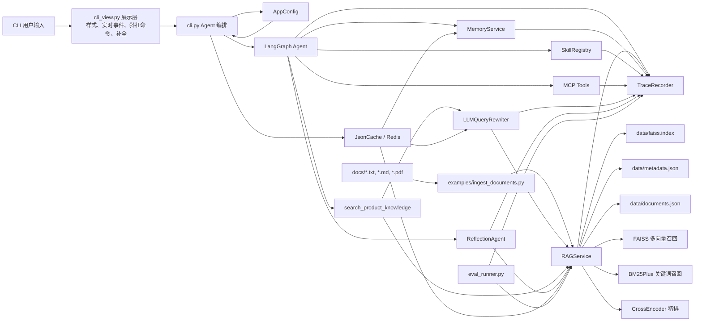

# RAG Server 项目技术文档

> 这份文档说明项目架构、模块边界、关键流程、配置参数、数据字段和扩展点。快速安装、最短启动命令和常见使用方式以 [README.md](./README.md) 为准；本文重点回答“每个模块是干嘛的、每个参数和字段有什么用”。

## 1. 项目定位

`RAG Server` 是一个本地可复用的中文 RAG / Agent 组件库，当前围绕电商客服知识库场景组织代码。它不是一个已经启动 HTTP 端口的 Web 服务，而是一组 Python 模块、一个 `rag-cli` 命令行智能体，以及围绕检索、长期记忆、Skills、MCP、Trace 和评测搭起来的工程底座。

从使用方式上看，它支持三类工作：

1. **作为检索库使用**：直接导入 `RAGService`，把本地 `.txt` / `.md` / `.pdf` 文档写入 FAISS + BM25 索引，再执行检索。
2. **作为命令行客服 Agent 使用**：运行 `rag-cli`，由 LangGraph Agent 自动调用知识库、长期记忆、Skills 和可选 MCP 工具。
3. **作为后续服务层底座使用**：如果以后要接 FastAPI、Flask、WebSocket、企业内部系统或其它应用层，可以复用当前 Python 模块，而不是重写检索和 Agent 编排。

当前默认模型栈：

| 能力 | 默认 provider | 默认模型 | 说明 |
|---|---|---|---|
| 聊天 / Agent | `tongyi` | `deepseek-v4-flash` | 通过 LangChain `ChatTongyi` 调用，使用默认配置时需要 `DASHSCOPE_API_KEY` |
| Query rewrite | 默认跟随 Agent | 默认跟随 Agent | 用于把用户问题改写成更适合检索的 query |
| 记忆抽取 | 默认跟随 Agent | 默认跟随 Agent | 对话结束后抽取可长期保存的用户偏好 |
| Embedding | `dashscope` | `text-embedding-v4` | 用于知识库和长期记忆的向量化 |
| Reranker | `cross_encoder` | `BAAI/bge-reranker-v2-m3` | 默认关闭；开启后首次可能下载较大模型权重 |

## 2. 代码结构总览

```text
RAG Server/
├── README.md                         # 快速上手、常用命令、使用示例
├── 项目技术文档.md                   # 当前这份详细技术文档
├── CLAUDE.md                         # Claude Code 项目指令与约定
├── pyproject.toml                    # 包元信息、依赖、rag-cli 入口
├── uv.lock                           # uv 锁定依赖
├── config.example.toml               # TOML 配置文件模板
├── mcp_servers.json                  # 默认 MCP 配置，通常为空
├── mcp_servers.example.json          # MCP 配置示例
├── LICENSE                           # MIT 许可证
├── .pre-commit-config.yaml           # pre-commit 钩子（ruff 格式化/检查）
├── .github/                          # GitHub Actions CI 工作流
├── .claude/                          # Claude Code 项目配置与 Skills 目录
├── docs/                             # 示例知识库文档
├── data/                             # 示例 / 默认 RAG 索引目录
│   ├── faiss.index                   # FAISS 向量索引
│   ├── metadata.json                 # chunk 级元数据
│   └── documents.json                # 文档级 manifest
├── examples/
│   └── ingest_documents.py           # 将 docs/ 批量入库的示例脚本
├── evals/
│   └── retrieval_eval.jsonl          # 检索评测数据集
├── prompts/                          # 系统提示词模板
│   ├── system_prompt.txt             # Agent 主系统提示
│   ├── query_rewrite_system.txt      # 查询改写提示
│   └── memory_extractor_system.txt   # 记忆抽取提示
├── tests/                            # 单元测试
└── rag_server/
    ├── __init__.py                   # 对外导出的主要类和函数
    ├── rag_service.py                # 文档入库、FAISS多向量、BM25、混合检索、精排
    ├── cli.py                        # LangGraph Agent 编排、工具定义、节点工厂
    ├── cli_view.py                   # CLI 展示层：样式、实时事件、斜杠命令、输入补全
    ├── config.py                     # 配置文件 / 环境变量 / CLI 参数合并与校验
    ├── model_factory.py              # 模型 provider 工厂
    ├── query_rewrite.py              # LLM 查询改写和多 query 融合检索
    ├── memory_service.py             # 长期记忆 SQLite + FAISS
    ├── reflection_service.py         # 回答后审校、补检索和修正
    ├── skill_service.py              # Anthropic-style Skills 发现和加载
    ├── mcp_service.py                # MCP 配置解析和工具加载
    ├── cache_service.py              # Redis 缓存服务封装
    ├── trace_service.py              # JSONL Trace、事件总线和摘要
    ├── llm_retry.py                  # LLM 超时、有限重试和退避
    ├── eval_service.py               # 检索评测核心逻辑
    ├── eval_runner.py                # 检索评测 CLI
    └── utils.py                      # 通用小工具
```

## 3. 总体架构



核心数据流：

1. **入库**：`docs/` 中的文档通过 `RAGService.sync_documents()` 写入 `data/`，生成文档 manifest、chunk 元数据和 FAISS 索引。
2. **检索**：用户问题进入异步 `search_product_knowledge` 工具；如果开启 Query rewrite，会先用 LLM 生成更适合检索的 query；随后 `RAGService` 做多向量召回、BM25 召回、加权融合和可选精排。
3. **Agent 对话**：`cli.py` 负责把记忆、Skills、RAG 工具、MCP 工具和主聊天模型组装成 LangGraph 流程；运行时优先走异步节点，多个工具调用可以并发执行。
4. **回答审校**：如果开启 Reflection，最终回复会再经过一次事实审校；必要时补检索并修正。
5. **长期记忆**：对话结束后抽取稳定用户偏好，写入 SQLite，并为当前用户重建记忆 FAISS 索引。
6. **追踪与评测**：关键模块都可以写 JSONL Trace；`eval_runner.py` 用评测集跑检索指标。

## 4. 运行时资产

### 4.1 `data/` 知识库索引目录

| 文件 | 生成者 | 用途 | 是否必须 |
|---|---|---|---|
| `data/faiss.index` | `RAGService` | FAISS `IndexFlatIP` 向量索引，保存 summary / keyword / semantic 三类子块向量 | 有文档入库后需要 |
| `data/metadata.json` | `RAGService` | 子块记录列表，包含文档来源、父子 chunk、embedding 文本和元数据 | 有文档入库后需要 |
| `data/documents.json` | `RAGService` | 文档级 manifest，用于判断文档是否变化、是否需要重建 | 有文档入库后需要 |

注意：

- BM25 索引不单独保存；进程启动时根据 `metadata.json` 里的记录重建。
- 如果 `documents.json` 缺失，`RAGService` 会尽量根据 `metadata.json` 补一个内存 manifest，然后再持久化。
- 如果 embedding provider、embedding 模型或 embedding kwargs 变化，`embedding_config_hash` 会变化，已有向量会被识别为过期并触发重建。

### 4.2 `memory/` 长期记忆目录

| 文件 / 目录 | 生成者 | 用途 |
|---|---|---|
| `memory/memory.sqlite` | `MemoryService` | 长期记忆结构化记录 |
| `memory/embedding_config.json` | `MemoryService` | 当前记忆向量索引使用的 embedding 配置指纹 |
| `memory/indexes/*.faiss` | `MemoryService` | 每个用户一个 FAISS 记忆索引 |
| `memory/indexes/*.ids.json` | `MemoryService` | FAISS 行号到 memory id 的映射 |

### 4.3 `traces/` 追踪目录

| 文件 | 生成者 | 用途 |
|---|---|---|
| `traces/<run_id>.jsonl` | `TraceRecorder` | 每行一个 JSON 事件，记录 RAG、Agent、Memory、Skill、MCP、Eval 等链路 |

`TraceRecorder` 也可以在 `enabled=False` 时只作为事件总线使用。CLI 实时事件打印就是这样工作的：即使不写 JSONL 文件，也可以把部分事件同步打印到终端。

## 5. 配置系统：`rag_server/config.py`

`config.py` 负责把默认值、配置文件、环境变量和 CLI 参数合并成统一的 `AppConfig`。它是 CLI 启动时的配置入口。

### 5.1 加载顺序

`load_app_config()` 的合并顺序如下，后者覆盖前者：

```text
AppConfig 默认值
  -> --config 或 RAG_SERVER_CONFIG 指向的 .toml / .json 文件
  -> RAG_SERVER_* 环境变量
  -> CLI overrides
```

配置文件只支持 `.toml` / `.tml` / `.json`。未知 section 或未知 key 会直接报 `ConfigError`，这样拼错字段不会静默失效。

### 5.2 `PathSettings`

| 字段 | 默认值 | 类型 | 作用 |
|---|---|---|---|
| `data_dir` | `"data"` | `str` | RAG 知识库索引目录，包含 `faiss.index`、`metadata.json`、`documents.json` |
| `memory_dir` | `"memory"` | `str` | 长期记忆目录，包含 SQLite 和记忆 FAISS 索引 |
| `trace_dir` | `"traces"` | `str` | JSONL Trace 输出目录 |
| `mcp_config_path` | `"mcp_servers.json"` | `str` | MCP 服务器配置文件路径 |

相关环境变量：

| 环境变量 | 对应字段 |
|---|---|
| `RAG_SERVER_DATA_DIR` | `paths.data_dir` |
| `RAG_SERVER_MEMORY_DIR` | `paths.memory_dir` |
| `RAG_SERVER_TRACE_DIR` | `paths.trace_dir` |
| `RAG_SERVER_MCP_CONFIG` | `paths.mcp_config_path` |

### 5.3 `AgentSettings`

| 字段 | 默认值 | 类型 | 作用 |
|---|---|---|---|
| `provider` | `"tongyi"` | `str` | 主 Agent 聊天模型 provider。内置支持 `tongyi`、`openai`，也可以是 Python import path |
| `model` | `"deepseek-v4-flash"` | `str` | 主 Agent 聊天模型名称 |
| `model_kwargs` | `{}` | `dict` | 透传给聊天模型构造函数的参数；CLI 中用 JSON 对象传入 |
| `user_id` | `"default_user"` | `str` | 长期记忆隔离用的用户标识 |
| `max_tool_rounds` | `6` | `int >= 0` | 单轮用户输入最多允许执行多少轮工具调用；防止 Agent 无限循环 |
| `max_repeated_tool_calls` | `2` | `int >= 1` | 同一轮里完全相同工具调用最多允许连续重复多少次 |
| `reflection_enabled` | `true` | `bool` | 是否启用回答后的 Reflection 审校和修正 |

相关环境变量：

| 环境变量 | 对应字段 |
|---|---|
| `RAG_SERVER_AGENT_PROVIDER` / `RAG_SERVER_CHAT_PROVIDER` | `agent.provider` |
| `RAG_SERVER_AGENT_MODEL` / `RAG_SERVER_CHAT_MODEL` | `agent.model` |
| `RAG_SERVER_AGENT_MODEL_KWARGS` / `RAG_SERVER_CHAT_MODEL_KWARGS` | `agent.model_kwargs` |
| `RAG_SERVER_USER_ID` | `agent.user_id` |
| `RAG_SERVER_MAX_TOOL_ROUNDS` | `agent.max_tool_rounds` |
| `RAG_SERVER_MAX_REPEATED_TOOL_CALLS` | `agent.max_repeated_tool_calls` |
| `RAG_SERVER_REFLECTION` | `agent.reflection_enabled` |

### 5.4 `RetrievalSettings`

| 字段 | 默认值 | 类型 | 作用 |
|---|---|---|---|
| `query_rewrite` | `"on"` | `str` | Query rewrite 模式：`on`、`off`、`rewrite_only`、`multi_query`；`on` 在运行时等价于 `multi_query` |
| `bm25` | `true` | `bool` | 是否启用 BM25 关键词召回 |
| `cross_encoder` | `false` | `bool` | 是否启用 CrossEncoder 精排 |
| `embedding_provider` | `"dashscope"` | `str` | 知识库和记忆的 embedding provider |
| `embedding_model` | `"text-embedding-v4"` | `str` | embedding 模型名称 |
| `embedding_kwargs` | `{}` | `dict` | 透传给 embedding 模型构造函数的参数 |
| `reranker_provider` | `"cross_encoder"` | `str` | reranker provider；内置 `cross_encoder` |
| `reranker_model` | `"BAAI/bge-reranker-v2-m3"` | `str` | CrossEncoder 模型名称 |
| `reranker_kwargs` | `{}` | `dict` | 透传给 reranker 构造函数的参数 |
| `reranker_device` | `null` | `str \| null` | reranker 加载设备，比如 `cpu`、`cuda`、`mps` |
| `reranker_batch_size` | `16` | `int >= 1` | reranker `predict()` 的 batch size |

相关环境变量：

| 环境变量 | 对应字段 |
|---|---|
| `RAG_SERVER_QUERY_REWRITE` | `retrieval.query_rewrite` |
| `RAG_SERVER_BM25` | `retrieval.bm25` |
| `RAG_SERVER_CROSS_ENCODER` | `retrieval.cross_encoder` |
| `RAG_SERVER_EMBEDDING_PROVIDER` | `retrieval.embedding_provider` |
| `RAG_SERVER_EMBEDDING_MODEL` | `retrieval.embedding_model` |
| `RAG_SERVER_EMBEDDING_KWARGS` / `RAG_SERVER_EMBEDDING_MODEL_KWARGS` | `retrieval.embedding_kwargs` |
| `RAG_SERVER_RERANKER_PROVIDER` / `RAG_SERVER_RERANK_PROVIDER` | `retrieval.reranker_provider` |
| `RAG_SERVER_RERANKER_MODEL` / `RAG_SERVER_RERANK_MODEL` | `retrieval.reranker_model` |
| `RAG_SERVER_RERANKER_KWARGS` / `RAG_SERVER_RERANK_KWARGS` | `retrieval.reranker_kwargs` |
| `RAG_SERVER_RERANKER_DEVICE` / `RAG_SERVER_RERANK_DEVICE` | `retrieval.reranker_device` |
| `RAG_SERVER_RERANKER_BATCH_SIZE` / `RAG_SERVER_RERANK_BATCH_SIZE` | `retrieval.reranker_batch_size` |

### 5.5 `LLMSettings`

| 字段 | 默认值 | 类型 | 作用 |
|---|---|---|---|
| `rewrite_provider` | `null` | `str \| null` | Query rewrite 模型 provider；为空时回落到 `agent.provider` |
| `rewrite_model` | `null` | `str \| null` | Query rewrite 模型名称；为空时回落到 `agent.model` |
| `rewrite_kwargs` | `{}` | `dict` | Query rewrite 模型构造参数；为空且 provider 为空时复用 `agent.model_kwargs` |
| `memory_provider` | `null` | `str \| null` | 记忆抽取模型 provider；为空时回落到 `agent.provider` |
| `memory_model` | `null` | `str \| null` | 记忆抽取模型名称；为空时回落到 `agent.model` |
| `memory_kwargs` | `{}` | `dict` | 记忆抽取模型构造参数；为空且 provider 为空时复用 `agent.model_kwargs` |
| `retry_attempts` | `3` | `int >= 1` | 每次 LLM 调用最多尝试次数 |
| `timeout_s` | `30.0` | `float \| null` | 单次 LLM 尝试超时时间；`null` 表示不启用超时 |
| `retry_backoff_s` | `1.0` | `float >= 0` | 首次重试等待秒数，后续指数退避 |

相关环境变量：

| 环境变量 | 对应字段 |
|---|---|
| `RAG_SERVER_QUERY_REWRITE_PROVIDER` / `RAG_SERVER_REWRITE_PROVIDER` | `llm.rewrite_provider` |
| `RAG_SERVER_QUERY_REWRITE_MODEL` / `RAG_SERVER_REWRITE_MODEL` | `llm.rewrite_model` |
| `RAG_SERVER_QUERY_REWRITE_KWARGS` / `RAG_SERVER_REWRITE_KWARGS` | `llm.rewrite_kwargs` |
| `RAG_SERVER_MEMORY_PROVIDER` | `llm.memory_provider` |
| `RAG_SERVER_MEMORY_MODEL` | `llm.memory_model` |
| `RAG_SERVER_MEMORY_KWARGS` / `RAG_SERVER_MEMORY_MODEL_KWARGS` | `llm.memory_kwargs` |
| `RAG_SERVER_LLM_RETRY_ATTEMPTS` | `llm.retry_attempts` |
| `RAG_SERVER_LLM_TIMEOUT` | `llm.timeout_s` |
| `RAG_SERVER_LLM_RETRY_BACKOFF` | `llm.retry_backoff_s` |

### 5.6 `MemorySettings`

| 字段 | 默认值 | 类型 | 作用 |
|---|---|---|---|
| `enabled` | `true` | `bool` | 是否启用长期记忆 |
| `top_k` | `5` | `int >= 1` | Agent 每轮加载 profile 层记忆数量；episode/procedure 层默认取 `max(1, top_k // 2)` |

相关环境变量：

| 环境变量 | 对应字段 |
|---|---|
| `RAG_SERVER_MEMORY` | `memory.enabled` |
| `RAG_SERVER_MEMORY_TOP_K` | `memory.top_k` |

### 5.7 `SkillsSettings`

| 字段 | 默认值 | 类型 | 作用 |
|---|---|---|---|
| `enabled` | `true` | `bool` | 是否启用 Anthropic-style Skills |
| `dirs` | `[]` | `list[str]` | 额外 Skills 目录；默认仍扫描 `.claude/skills` |

相关环境变量：

| 环境变量 | 对应字段 | 说明 |
|---|---|---|
| `RAG_SERVER_SKILLS` | `skills.enabled` | `on/off`、`true/false`、`1/0` |
| `RAG_SERVER_SKILLS_DIRS` | `skills.dirs` | 支持逗号分隔多个目录 |

### 5.8 `MCPSettings`

| 字段 | 默认值 | 类型 | 作用 |
|---|---|---|---|
| `enabled` | `false` | `bool` | 是否加载 MCP 工具 |

相关环境变量：`RAG_SERVER_MCP`。

### 5.9 `TraceSettings`

| 字段 | 默认值 | 类型 | 作用 |
|---|---|---|---|
| `enabled` | `false` | `bool` | 是否写入 JSONL trace 文件 |
| `live` | `false` | `bool` | 是否在 CLI 实时展示 RAG、Memory、Skill、MCP 等事件 |

相关环境变量：

| 环境变量 | 对应字段 |
|---|---|
| `RAG_SERVER_TRACE` | `trace.enabled` |
| `RAG_SERVER_LIVE_EVENTS` / `RAG_SERVER_LIVE_LOGS` | `trace.live` |
| `RAG_SERVER_CLI_LIVE_EVENTS` / `RAG_SERVER_CLI_LIVE_LOGS` | `trace.live` |

### 5.10 `CLISettings`

| 字段 | 默认值 | 类型 | 作用 |
|---|---|---|---|
| `show_config` | `false` | `bool` | CLI 启动时是否打印模型、目录、开关、工具等配置摘要 |
| `stream_output` | `true` | `bool` | CLI 是否启用回答流式输出；关闭后一次性输出完整回答 |

相关环境变量：

| 环境变量 | 对应字段 |
|---|---|
| `RAG_SERVER_SHOW_CONFIG` | `cli.show_config` |
| `RAG_SERVER_CLI_SHOW_CONFIG` | `cli.show_config` |
| `RAG_SERVER_CLI_CONFIG_OUTPUT` | `cli.show_config` |
| `RAG_SERVER_STREAM_OUTPUT` | `cli.stream_output` |
| `RAG_SERVER_CLI_STREAM_OUTPUT` | `cli.stream_output` |

### 5.11 `CacheSettings`

Redis 缓存默认开启。启用后会缓存 query rewrite、query embedding、检索结果、rerank 结果和短 TTL 的记忆检索；Redis 连接失败或运行期异常都会降级为 cache miss。
各 TTL 字段设为 `0` 时表示不写入对应类别缓存。

| 字段 | 默认值 | 类型 | 作用 |
|---|---|---|---|
| `enabled` | `true` | `bool` | 是否启用 Redis 缓存 |
| `redis_url` | `"redis://localhost:6379/0"` | `str` | Redis 连接地址 |
| `namespace` | `"rag-server"` | `str` | Redis key namespace |
| `socket_timeout_s` | `0.2` | `float >= 0` | Redis 连接和读写超时秒数 |
| `query_rewrite_ttl_s` | `86400` | `int >= 0` | 查询改写缓存 TTL |
| `embedding_ttl_s` | `604800` | `int >= 0` | query / memory embedding 缓存 TTL |
| `retrieval_ttl_s` | `3600` | `int >= 0` | 检索结果缓存 TTL |
| `rerank_ttl_s` | `86400` | `int >= 0` | CrossEncoder 精排结果缓存 TTL |
| `memory_ttl_s` | `300` | `int >= 0` | 长期记忆检索缓存 TTL |

相关环境变量包括 `RAG_SERVER_CACHE`、`RAG_SERVER_REDIS_URL`、`RAG_SERVER_CACHE_NAMESPACE`、`RAG_SERVER_CACHE_QUERY_REWRITE_TTL`、`RAG_SERVER_CACHE_EMBEDDING_TTL`、`RAG_SERVER_CACHE_RETRIEVAL_TTL`、`RAG_SERVER_CACHE_RERANK_TTL` 和 `RAG_SERVER_CACHE_MEMORY_TTL`。

### 5.12 配置别名

为了兼容旧字段，`_normalize_mapping()` 支持一些别名：

| 旧字段 | 新字段 |
|---|---|
| `paths.mcp_config` | `paths.mcp_config_path` |
| `agent.chat_provider` | `agent.provider` |
| `agent.chat_model` | `agent.model` |
| `agent.chat_model_kwargs` | `agent.model_kwargs` |
| `agent.reflection` | `agent.reflection_enabled` |
| `retrieval.query_rewrite_mode` | `retrieval.query_rewrite` |
| `retrieval.bm25_enabled` | `retrieval.bm25` |
| `retrieval.cross_encoder_enabled` | `retrieval.cross_encoder` |
| `retrieval.embedding_model_name` | `retrieval.embedding_model` |
| `retrieval.embedding_model_kwargs` | `retrieval.embedding_kwargs` |
| `retrieval.rerank_provider` | `retrieval.reranker_provider` |
| `retrieval.rerank_model` / `retrieval.rerank_model_name` / `retrieval.reranker_model_name` | `retrieval.reranker_model` |
| `retrieval.rerank_kwargs` / `retrieval.rerank_model_kwargs` / `retrieval.reranker_model_kwargs` | `retrieval.reranker_kwargs` |
| `retrieval.rerank_device` | `retrieval.reranker_device` |
| `retrieval.rerank_batch_size` | `retrieval.reranker_batch_size` |
| `llm.query_rewrite_provider` | `llm.rewrite_provider` |
| `llm.query_rewrite_model` | `llm.rewrite_model` |
| `llm.query_rewrite_kwargs` | `llm.rewrite_kwargs` |
| `llm.llm_retry_attempts` | `llm.retry_attempts` |
| `llm.llm_timeout_s` | `llm.timeout_s` |
| `llm.llm_retry_backoff_s` | `llm.retry_backoff_s` |
| `memory.memory_top_k` | `memory.top_k` |
| `trace.live_events` / `trace.live_logs` / `cli.live_events` / `cli.live_logs` | `trace.live` |
| `cli.startup_config` / `cli.show_startup_config` / `cli.config_output` | `cli.show_config` |
| `cli.streaming` / `cli.stream_output_enabled` | `cli.stream_output` |
| `cache.url` | `cache.redis_url` |
| `cache.ttl_query_rewrite_s` | `cache.query_rewrite_ttl_s` |
| `cache.ttl_embedding_s` | `cache.embedding_ttl_s` |
| `cache.ttl_retrieval_s` | `cache.retrieval_ttl_s` |
| `cache.ttl_rerank_s` | `cache.rerank_ttl_s` |
| `cache.ttl_memory_s` | `cache.memory_ttl_s` |

### 5.13 示例配置

```toml
[paths]
data_dir = "data"
memory_dir = "memory"
trace_dir = "traces"
mcp_config_path = "mcp_servers.json"

[agent]
provider = "tongyi"
model = "deepseek-v4-flash"
model_kwargs = {}
user_id = "default_user"
max_tool_rounds = 6
max_repeated_tool_calls = 2
reflection_enabled = true

[retrieval]
query_rewrite = "on"
bm25 = true
cross_encoder = false
embedding_provider = "dashscope"
embedding_model = "text-embedding-v4"
embedding_kwargs = {}
reranker_provider = "cross_encoder"
reranker_model = "BAAI/bge-reranker-v2-m3"
reranker_kwargs = {}
reranker_device = ""
reranker_batch_size = 16

[llm]
# rewrite_provider = "tongyi"
# rewrite_model = "deepseek-v4-flash"
# rewrite_kwargs = {}
# memory_provider = "tongyi"
# memory_model = "deepseek-v4-flash"
# memory_kwargs = {}
retry_attempts = 3
timeout_s = 30
retry_backoff_s = 1

[memory]
enabled = true
top_k = 5

[skills]
enabled = true
dirs = []

[mcp]
enabled = false

[trace]
enabled = false
live = false

[cli]
show_config = false

[cache]
enabled = true
redis_url = "redis://localhost:6379/0"
namespace = "rag-server"
socket_timeout_s = 0.2
query_rewrite_ttl_s = 86400
embedding_ttl_s = 604800
retrieval_ttl_s = 3600
rerank_ttl_s = 86400
memory_ttl_s = 300
```

## 6. 模型工厂：`rag_server/model_factory.py`

`model_factory.py` 把具体模型厂商封装在统一工厂里，让业务模块不用直接依赖某个 SDK。

### 6.1 默认常量

| 常量 | 值 | 用途 |
|---|---|---|
| `DEFAULT_CHAT_PROVIDER` | `"tongyi"` | 默认聊天模型 provider |
| `DEFAULT_CHAT_MODEL` | `"deepseek-v4-flash"` | 默认聊天模型 |
| `DEFAULT_EMBEDDING_PROVIDER` | `"dashscope"` | 默认 embedding provider |
| `DEFAULT_EMBEDDING_MODEL` | `"text-embedding-v4"` | 默认 embedding 模型 |
| `DEFAULT_RERANKER_PROVIDER` | `"cross_encoder"` | 默认 reranker provider |
| `DEFAULT_RERANKER_MODEL` | `"BAAI/bge-reranker-v2-m3"` | 默认 reranker 模型 |

### 6.2 `create_chat_model(provider, model_name, **model_kwargs)`

作用：创建 LangChain 兼容聊天模型。

| 参数 | 说明 |
|---|---|
| `provider` | 内置支持 `tongyi`、`dashscope`、`chat_tongyi`、`openai`、`chat_openai`；也支持 import path |
| `model_name` | 模型名，内置 provider 会传给对应 SDK 的 `model` 参数 |
| `model_kwargs` | 透传给模型构造函数；值为 `None` 的项会被 `_clean_kwargs()` 去掉 |

行为：

- `tongyi` / `dashscope` / `chat_tongyi` 创建 `langchain_community.chat_models.ChatTongyi`。
- `openai` / `chat_openai` 创建 `langchain_openai.ChatOpenAI`，但需要额外安装 `langchain-openai`。
- 自定义 provider 通过 `import_provider()` 加载。
- Tongyi 和自定义聊天 provider 默认设置 `max_retries=0`，因为项目自己的 `LLMRetryPolicy` 统一负责重试。

### 6.3 `create_embeddings(provider, model_name, **model_kwargs)`

作用：创建 embedding 模型。

| 参数 | 说明 |
|---|---|
| `provider` | 内置支持 `dashscope`、`dashscope_embeddings`、`openai`、`openai_embeddings`；也支持 import path |
| `model_name` | embedding 模型名 |
| `model_kwargs` | 透传构造参数 |

返回对象需要至少支持 `embed_documents(texts)`；如果还支持 `embed_query(text)`，`RAGService` 会优先使用它处理查询向量。

### 6.4 `create_reranker(provider, model_name, device=None, **model_kwargs)`

作用：创建重排序模型。

| 参数 | 说明 |
|---|---|
| `provider` | 内置支持 `cross_encoder`、`sentence_transformers`、`sentence_transformers_cross_encoder`；也支持 import path |
| `model_name` | reranker 模型名 |
| `device` | 可选设备，比如 `cpu`、`cuda`、`mps` |
| `model_kwargs` | 透传构造参数 |

内置 CrossEncoder 使用 `sentence_transformers.CrossEncoder`，默认补 `trust_remote_code=True`。返回对象需要支持：

```python
predict(pairs, batch_size=..., show_progress_bar=False)
```

### 6.5 自定义 provider import path

自定义 provider 可以写成两种形式：

```text
package.module:Factory
package.module.Factory
```

`instantiate_model_provider()` 会尽量适配常见模型参数名：

- 聊天 / embedding 默认尝试 `model`、`model_name`、`model_id`
- reranker 额外尝试 `model_name_or_path`

如果 provider 的构造函数支持 `**kwargs`，所有清洗后的 kwargs 都会传入；否则只传函数签名里声明过的参数。

### 6.6 `model_config_fingerprint()`

作用：把 `provider`、`model_name`、`model_kwargs` 做成稳定 SHA256 指纹。这个指纹写入知识库和记忆索引元数据，用来判断已持久化的 embedding 是否和当前模型配置一致。

字段含义：

| 输入 | 作用 |
|---|---|
| `provider` | 区分不同 provider，例如 `dashscope` 和自定义 provider |
| `model_name` | 区分不同 embedding 模型 |
| `model_kwargs` | 区分维度、endpoint、兼容参数等可能影响向量结果的设置 |

## 7. RAG 检索核心：`rag_server/rag_service.py`

`RAGService` 是项目最核心的检索模块。它负责文档读取、父子分块、多向量 embedding、FAISS 持久化、BM25、混合召回、可选 CrossEncoder 精排和文档生命周期管理。

### 7.1 模块常量

| 常量 | 值 | 作用 |
|---|---|---|
| `SUPPORTED_EXTENSIONS` | `{".txt", ".md", ".pdf"}` | 支持入库的文档扩展名 |
| `DOCUMENTS_MANIFEST_VERSION` | `1` | `documents.json` 的 manifest 版本 |
| `CHUNKING_STRATEGY` | `"parent_child"` | 当前分块策略 |
| `PARENT_CHILD_OVERFETCH_FACTOR` | `5` | 检索候选扩张系数，`top_k` 会先扩成最多 `top_k * 5` 个子块候选 |
| `MULTI_VECTOR_STRATEGY` | `"summary_keyword_semantic_v1"` | 当前多向量策略 |
| `MULTI_VECTOR_TYPES` | `("summary", "keyword", "semantic")` | 每个子块生成三类 embedding 文本 |
| `DEFAULT_MULTI_VECTOR_WEIGHTS` | summary 0.25, keyword 0.25, semantic 0.5 | 多向量分数聚合权重 |
| `MAX_SUMMARY_EMBEDDING_CHARS` | `240` | summary embedding 文本最大长度 |
| `MAX_KEYWORD_TERMS` | `16` | keyword embedding 文本最多关键词数 |
| `KEYWORD_STOPWORDS` | 中文停用词集合 | 抽关键词时过滤低信息量词 |

### 7.2 `RAGService.__init__()` 参数

| 参数 | 默认值 | 作用 |
|---|---|---|
| `data_dir` | `"data"` | 索引和元数据目录 |
| `model_name` | `DEFAULT_EMBEDDING_MODEL` | 兼容旧参数；当 `embedding_model_name` 为空时作为 embedding 模型名 |
| `embedding_provider` | `DEFAULT_EMBEDDING_PROVIDER` | embedding provider |
| `embedding_model_name` | `None` | embedding 模型名；为空时使用 `model_name` |
| `embedding_model_kwargs` | `None` | 传给 embedding provider 的构造参数 |
| `embeddings` | `None` | 外部注入 embedding 对象；用于测试或自定义实现 |
| `reranker_provider` | `DEFAULT_RERANKER_PROVIDER` | reranker provider |
| `reranker_model_name` | `DEFAULT_RERANKER_MODEL` | reranker 模型名 |
| `reranker_model_kwargs` | `None` | 传给 reranker 构造函数的参数 |
| `reranker` | `None` | 外部注入 reranker 对象 |
| `reranker_device` | `None` | reranker 加载设备 |
| `reranker_batch_size` | `16` | reranker `predict()` batch size |
| `default_use_bm25` | `True` | `search()` 默认是否启用 BM25 |
| `default_use_rerank` | `False` | `search()` 默认是否启用 rerank |
| `default_candidate_top_k` | `20` | `search()` 默认先取多少候选再精排 |
| `chunk_size` | `500` | 子块大小 |
| `chunk_overlap` | `100` | 子块重叠大小 |
| `parent_chunk_size` | `None` | 父块大小；默认 `max(chunk_size * 3, chunk_size)` |
| `parent_chunk_overlap` | `None` | 父块重叠；默认 `min(chunk_overlap * 2, parent_chunk_size - 1)` |
| `trace_recorder` | `None` | 可选 TraceRecorder |
| `multi_vector_weights` | `None` | 覆盖 summary / keyword / semantic 的聚合权重 |
| `cache` | `None` | 可选 JSON 缓存，CLI 启用 Redis 时注入 |
| `cache_ttls` | `None` | 各类缓存 TTL 覆盖 |

初始化时会做这些事：

1. 创建 `data_dir`。
2. 校验分块参数。
3. 创建或接收 embedding 对象。
4. 记录 embedding 配置指纹。
5. 加载 `documents.json` 和 `metadata.json`。
6. 尝试补齐缺失 manifest。
7. 检查 embedding 元数据是否过期。
8. 根据记录构建 `vector_rows`。
9. 加载或重建 FAISS。
10. 根据 `records` 重建 BM25。
11. 如 manifest 或 embedding 元数据有变化，重新持久化。

启用缓存时，`search()` / `asearch()`、`search_by_hybrid()` / `asearch_by_hybrid()`、`rerank()` 和 query embedding 会使用 Redis。检索结果 key 带知识库版本指纹；文档新增、更新、删除或 reset 后版本会变化，旧缓存自然失效。

### 7.3 异步检索策略

`RAGService` 保留同步 API，同时提供等价异步入口，便于 CLI Agent、Web 服务或 WebSocket 场景在一个事件循环里复用检索能力。

| 同步入口 | 异步入口 | 异步行为 |
|---|---|---|
| `search_by_hybrid(...)` | `asearch_by_hybrid(...)` | 向量分支和 BM25 分支通过 `asyncio.gather()` 并发执行；两个分支内部用 `asyncio.to_thread()` 调用现有同步计算 |
| `rerank(...)` | `arerank(...)` | 用 `asyncio.to_thread()` 包装 CrossEncoder `predict()` |
| `search(...)` | `asearch(...)` | 先调用 `asearch_by_hybrid()`，如果启用精排再调用 `arerank()` |

异步入口保持同步入口的参数、返回字段和 trace 事件名不变。这样调用方可以按运行环境选择 `rag.search()` 或 `await rag.asearch()`，而不需要维护两套结果解析逻辑。

需要注意：

- 这是单进程内的异步调度优化，不是分布式并发控制。
- 入库、删除、同步文档等写操作仍是同步方法，适合由单写入者或外部任务队列串行调用。
- `asyncio.to_thread()` 会把阻塞型 embedding、FAISS、BM25 或 CrossEncoder 计算挪到线程池，避免直接卡住事件循环；底层模型或索引对象本身是否线程安全仍取决于具体 provider。

### 7.4 分块参数校验

`_validate_chunking_config()` 会保证：

| 条件 | 目的 |
|---|---|
| `chunk_size > 0`、`parent_chunk_size > 0` | 分块长度必须有效 |
| `chunk_overlap >= 0`、`parent_chunk_overlap >= 0` | 重叠不能为负 |
| `chunk_overlap < chunk_size` | 子块重叠不能覆盖整个子块 |
| `parent_chunk_overlap < parent_chunk_size` | 父块重叠不能覆盖整个父块 |
| `chunk_size <= parent_chunk_size` | 子块不能比父块更大 |

### 7.5 入库 API

#### `add_documents(file_paths, chunk_size=None, chunk_overlap=None, parent_chunk_size=None, parent_chunk_overlap=None)`

作用：兼容性入口，本质上调用 `upsert_documents()`。适合一次性添加或重复运行入库脚本。

#### `upsert_documents(...)`

作用：新增文档或替换已变化文档。它是幂等的：文档内容、分块参数、embedding 策略和 embedding 配置都没变时，会跳过，不重复写入 chunk。

返回字段：

| 字段 | 类型 | 含义 |
|---|---|---|
| `added_chunks` | `int` | 本次新增的子块数量 |
| `added_parent_chunks` | `int` | 本次新增的父块数量 |
| `deleted_chunks` | `int` | 因更新或删除移除的旧子块数量 |
| `sources` | `list[str]` | 本次实际新增记录涉及的 source |
| `added_documents` | `list[str]` | 本次新增文档 source |
| `updated_documents` | `list[str]` | 本次更新文档 source |
| `skipped_documents` | `list[str]` | 内容和配置未变化而跳过的文档 source |

#### `update_document(file_path, ...)`

作用：更新单个文档。内部还是调用 `upsert_documents([file_path])`。

#### `delete_document(document_ref)`

作用：按 `doc_id` 或 source 路径删除一个文档，并重建 FAISS / BM25。

返回字段：

| 字段 | 含义 |
|---|---|
| `deleted_chunks` | 删除的子块数量 |
| `document_id` | 被删除的文档 id；未找到时为 `None` |
| `source` | 被删除文档的 source；未找到时回显输入引用 |

#### `sync_documents(file_paths, remove_missing=False, ...)`

作用：把索引同步到指定文件集合。

| 参数 | 说明 |
|---|---|
| `file_paths` | 期望存在于索引中的文档路径列表 |
| `remove_missing` | `False` 时只 upsert；`True` 时删除索引里存在但不在 `file_paths` 中的文档 |
| `chunk_size` / `chunk_overlap` | 可覆盖子块参数 |
| `parent_chunk_size` / `parent_chunk_overlap` | 可覆盖父块参数 |

当 `remove_missing=True` 时，返回结果会额外包含 `removed_documents`。

#### `list_documents()`

作用：返回当前 manifest 中的文档列表，按 source 排序。

#### `reset()`

作用：清空 `records`、`documents`、FAISS 和 BM25，并持久化空索引。这个方法会删除当前知识库内容，通常只在测试或重建时使用。

### 7.6 文档读取

`_read_document(path)` 支持：

| 扩展名 | 读取方式 |
|---|---|
| `.txt` | `Path.read_text(encoding="utf-8").strip()` |
| `.md` | `Path.read_text(encoding="utf-8").strip()` |
| `.pdf` | `pypdf.PdfReader`，拼接每页 `extract_text()` |

PDF 只做文本抽取，不做 OCR。如果 PDF 是扫描件或图片型文档，通常抽不出有效内容。

### 7.7 父子分块

入库时先切父块，再在每个父块里切子块：

```text
原始文档
  -> parent_chunk_size / parent_chunk_overlap
  -> parent_content
  -> chunk_size / chunk_overlap
  -> child_content
```

为什么这样设计：

- 子块更短，适合向量召回和 BM25 匹配。
- 父块更长，返回给 LLM 时上下文更完整。
- 检索阶段以子块命中，最终按父块去重并返回父块内容。

`RecursiveCharacterTextSplitter` 的分隔符顺序：

```python
["\n\n", "\n", "。", "！", "？", "；", "，", " ", ""]
```

这会优先保留段落、换行和中文标点边界。

### 7.8 标识规则

| 标识 | 生成规则 | 用途 |
|---|---|---|
| `doc_id` | `sha256(解析后的绝对路径)[:24]` | 文档级主键 |
| `source_hash` | `sha256(文档全文)` | 判断文件内容是否变化 |
| `parent_id` / `chunk_id` | `<doc_id>:parent:<parent_index>:<parent_content_hash前12位>` | 父块标识，也是最终返回内容的 chunk 标识 |
| `child_chunk_id` / `id` | `<doc_id>:parent:<parent_index>:child:<child_index>:<content_hash前12位>` | 子块标识，作为 FAISS / BM25 实际索引单元 |
| `content_hash` | `sha256(子块文本)` | 子块内容指纹 |
| `parent_content_hash` | `sha256(父块文本)` | 父块内容指纹 |
| `embedding_config_hash` | `model_config_fingerprint(...)` | 判断向量是否由当前 embedding 配置生成 |

### 7.9 `documents.json` 字段

文件结构：

```json
{
  "version": 1,
  "documents": {
    "<doc_id>": {
      "doc_id": "...",
      "source": "...",
      "source_hash": "...",
      "chunk_count": 10,
      "parent_chunk_count": 4,
      "chunk_size": 500,
      "chunk_overlap": 100,
      "parent_chunk_size": 1500,
      "parent_chunk_overlap": 200,
      "chunking_strategy": "parent_child",
      "embedding_strategy": "summary_keyword_semantic_v1",
      "embedding_types": ["summary", "keyword", "semantic"],
      "embedding_provider": "dashscope",
      "embedding_model": "text-embedding-v4",
      "embedding_config_hash": "...",
      "indexed_at": "...",
      "version": 1
    }
  }
}
```

字段说明：

| 字段 | 含义 |
|---|---|
| `version` | manifest 格式版本 |
| `documents` | 以 `doc_id` 为 key 的文档元数据字典 |
| `doc_id` | 文档主键 |
| `source` | 入库时使用的源路径 |
| `source_hash` | 文档全文哈希 |
| `chunk_count` | 子块数量 |
| `parent_chunk_count` | 父块数量 |
| `chunk_size` / `chunk_overlap` | 子块切分参数 |
| `parent_chunk_size` / `parent_chunk_overlap` | 父块切分参数 |
| `chunking_strategy` | 分块策略；当前为 `parent_child` |
| `embedding_strategy` | embedding 文本生成策略 |
| `embedding_types` | 每个子块生成哪些向量类型 |
| `embedding_provider` / `embedding_model` | 当前索引使用的 embedding 配置 |
| `embedding_config_hash` | embedding 配置指纹 |
| `indexed_at` | 索引写入时间，UTC ISO 字符串 |
| `version` | 单个文档版本；每次更新会递增 |

### 7.10 `metadata.json` 记录字段

`metadata.json` 当前持久化的是 records 列表。单条记录是一个子块：

| 字段 | 类型 | 含义 |
|---|---|---|
| `id` | `str` | 子块 id，也等于 `child_chunk_id` |
| `doc_id` | `str` | 所属文档 id |
| `source` | `str` | 原始文档路径 |
| `source_hash` | `str` | 文档全文哈希 |
| `content_hash` | `str` | 子块文本哈希 |
| `content` | `str` | 子块文本，供 BM25 和向量检索使用 |
| `embedding_texts` | `dict[str, str]` | 三类 embedding 文本：`summary`、`keyword`、`semantic` |
| `parent_id` | `str` | 父块 id |
| `parent_content_hash` | `str` | 父块文本哈希 |
| `parent_content` | `str` | 父块文本，最终返回给 LLM |
| `metadata` | `dict` | 检索结果携带的细粒度元数据 |

`metadata` 内部字段：

| 字段 | 含义 |
|---|---|
| `doc_id` | 文档 id |
| `chunk_id` | 父块 id；保留这个名字是为了兼容过去的 chunk 字段 |
| `chunk_index` | 父块在文档中的序号 |
| `parent_id` | 父块 id |
| `parent_index` | 父块序号 |
| `parent_content_hash` | 父块文本哈希 |
| `child_chunk_id` | 子块 id |
| `child_chunk_index` | 子块在整个文档 records 中的序号 |
| `child_index` | 子块在当前父块内的序号 |
| `source_hash` | 文档全文哈希 |
| `chunking_strategy` | 当前分块策略 |
| `embedding_strategy` | 当前 embedding 文本策略 |
| `embedding_types` | 三类向量类型列表 |
| `embedding_provider` / `embedding_model` | 当前 embedding 配置 |
| `embedding_config_hash` | embedding 配置指纹 |

### 7.11 三类 embedding 文本

每个子块会生成三份文本并分别向量化：

| 类型 | 生成方式 | 作用 |
|---|---|---|
| `summary` | 取前 1 到 2 句，最多 `240` 字符，前缀 `摘要:` | 捕捉片段主题 |
| `keyword` | 用 `jieba.lcut_for_search()` 分词、去停用词、按频次取最多 16 个关键词，前缀 `关键词:` | 对商品属性、尺码、颜色、洗护词更敏感 |
| `semantic` | 归一化空白后的完整子块，前缀 `语义:` | 保留完整语义 |

多向量召回时，FAISS 实际索引行数约等于 `子块数量 * 3`。`vector_rows` 负责把 FAISS 行号映射回：

| 字段 | 含义 |
|---|---|
| `record_index` | 对应 `records` 中第几个子块 |
| `vector_type` | `summary` / `keyword` / `semantic` |
| `text` | 实际被 embedding 的文本 |

### 7.12 检索 API

#### `search_by_vector(query, top_k=3)`

只做多向量召回，不用 BM25、不做 rerank。

返回流程：

1. 对 query 做 embedding。
2. 从 FAISS 取候选向量行。
3. 按 `record_index` 聚合同一子块命中的不同向量类型。
4. 根据 `multi_vector_weights` 算 `vector_score`。
5. 按父块去重。
6. 返回前 `top_k`。

#### `search_by_bm25(query, top_k=3, use_bm25=None)`

只做 BM25 关键词召回。

| 参数 | 说明 |
|---|---|
| `query` | 用户查询 |
| `top_k` | 最终返回数量 |
| `use_bm25` | 覆盖实例默认开关；为 `False` 时直接返回空列表 |

BM25 使用 `jieba.lcut_for_search()` 分词和 `rank_bm25.BM25Plus`。原始 BM25 分数会按当前查询最大值归一化到 `[0, 1]`。

#### `search_by_hybrid(query, top_k=10, vector_weight=0.7, bm25_weight=0.3, use_bm25=None)`

混合召回，不做精排。

| 参数 | 默认值 | 说明 |
|---|---|---|
| `query` | 必填 | 查询文本 |
| `top_k` | `10` | 返回数量 |
| `vector_weight` | `0.7` | 多向量分数权重 |
| `bm25_weight` | `0.3` | BM25 分数权重 |
| `use_bm25` | `None` | 为空时使用实例默认 `default_use_bm25` |

如果 BM25 关闭，向量权重会自动设为 `1.0`，BM25 权重为 `0.0`。权重必须非负，且不能同时为 0。

融合公式：

```text
hybrid_score = vector_weight * vector_score + bm25_weight * bm25_score
```

异步等价入口：`asearch_by_hybrid(...)`。它会并发执行向量候选计算和 BM25 候选计算，之后复用同一套融合、父块去重和 trace 逻辑。

#### `rerank(query, candidates, top_k=None)`

对候选结果做 CrossEncoder 精排。

| 参数 | 说明 |
|---|---|
| `query` | 原始查询 |
| `candidates` | `search_by_hybrid()` 或其它检索结果列表 |
| `top_k` | 为空时返回全部精排结果，否则截断到指定数量 |

内部会调用：

```python
reranker.predict(
    [(query, item["content"]) for item in candidates],
    batch_size=self.reranker_batch_size,
    show_progress_bar=False,
)
```

如果模型返回多维分数，当前实现取最后一列作为相关性分数。

异步等价入口：`arerank(...)`。当前实现通过线程池执行同步 reranker，避免阻塞调用方事件循环。

#### `search(query, top_k=3, vector_weight=0.7, bm25_weight=0.3, use_bm25=None, use_rerank=None, candidate_top_k=None)`

默认检索入口。

| 参数 | 默认值 | 说明 |
|---|---|---|
| `query` | 必填 | 查询文本 |
| `top_k` | `3` | 最终返回数量 |
| `vector_weight` | `0.7` | 向量分数融合权重 |
| `bm25_weight` | `0.3` | BM25 分数融合权重 |
| `use_bm25` | `None` | 覆盖 BM25 开关 |
| `use_rerank` | `None` | 覆盖 rerank 开关 |
| `candidate_top_k` | `None` | 精排前候选数量；为空时使用 `default_candidate_top_k`，且至少等于 `top_k` |

流程：

```text
query
  -> search_by_hybrid(candidate_top_k)
  -> 如果 use_rerank=false，直接取 top_k
  -> 如果 use_rerank=true，rerank 后取 top_k
```

异步等价入口：`asearch(...)`。它保持同样的参数含义和返回字段，内部调用 `asearch_by_hybrid()` 和可选 `arerank()`。

### 7.13 检索结果字段

`RAGService` 返回的每个结果包含：

| 字段 | 类型 | 含义 |
|---|---|---|
| `score` | `float` | 当前排序用分数；未精排时等于 `hybrid_score` 或单路分数，精排后等于 `rerank_score` |
| `vector_score` | `float` | 多向量聚合分数 |
| `bm25_score` | `float` | 归一化 BM25 分数 |
| `hybrid_score` | `float` | 向量和 BM25 融合后的分数 |
| `rerank_score` | `float \| None` | CrossEncoder 分数；未精排时为 `None` |
| `multi_vector_scores` | `dict[str, float]` | 当前子块命中的各向量类型分数 |
| `matched_vector_types` | `list[str]` | 命中的向量类型，按分数从高到低 |
| `best_vector_type` | `str \| None` | 分数最高的向量类型 |
| `content` | `str` | 父块文本，是最终返回给 Agent / 用户上下文的内容 |
| `child_content` | `str` | 实际命中的子块文本 |
| `source` | `str` | 文档路径 |
| `doc_id` | `str` | 文档 id |
| `metadata` | `dict` | 父子 chunk、embedding 配置等元数据 |
| `retrieval_mode` | `str` | `multi_vector`、`bm25`、`hybrid` 或 `hybrid_rerank` |

分数说明：

- 向量使用 L2 归一化后内积，近似余弦相似度。
- 原始内积分数按 `(score + 1) / 2` 映射到 `[0, 1]`。
- 多向量聚合只对实际命中的类型加权；如果命中的类型没有有效权重，则取最大分数。
- BM25 按当前 query 的最大 BM25 分数归一化。
- CrossEncoder 分数不强制归一化，直接作为最终排序分数。

### 7.14 Trace 事件

`RAGService` 会在配置了 `trace_recorder` 时记录：

| 事件名 | 类型 | 说明 |
|---|---|---|
| `rag.upsert_documents` | `rag` | 文档新增、更新、跳过和删除 chunk 数 |
| `rag.delete_document` | `rag` | 删除文档结果 |
| `rag.search_by_vector` | `rag` | 向量召回结果、候选数、耗时 |
| `rag.search_by_bm25` | `rag` | BM25 tokens、候选数、耗时 |
| `rag.search_by_hybrid` | `rag` | 混合召回权重、候选数、结果摘要 |
| `rag.rerank` | `rag` | 精排模型、候选摘要、结果摘要 |
| `rag.search` | `rag` | 默认检索入口的整体统计 |

## 8. Query Rewrite：`rag_server/query_rewrite.py`

这个模块负责把用户原问题改写成更适合知识库检索的 query。它不回答问题，只产出检索 query。

### 8.1 `QueryRewriteResult`

| 字段 | 类型 | 含义 |
|---|---|---|
| `original_query` | `str` | 用户原始问题 |
| `rewritten_query` | `str` | 规范化后的主检索 query |
| `search_queries` | `list[str]` | 1 到 3 条检索 query，按推荐顺序排列 |
| `notes` | `list[str]` | 改写说明或注意点 |
| `raw_response` | `str` | LLM 原始输出 |

### 8.2 `LLMQueryRewriter.__init__()` 参数

| 参数 | 默认值 | 作用 |
|---|---|---|
| `model_name` | 默认聊天模型 | Query rewrite 模型名 |
| `provider` | 默认聊天 provider | Query rewrite provider |
| `model_kwargs` | `None` | 模型构造参数 |
| `model` | `None` | 外部注入模型对象 |
| `trace_recorder` | `None` | 记录 rewrite 和重试事件 |
| `retry_policy` | `None` | LLM 重试策略；为空时使用默认 `LLMRetryPolicy()` |
| `cache` | `None` | 可选 JSON 缓存 |
| `cache_ttl_s` | `86400` | 查询改写缓存 TTL |

### 8.3 `rewrite(query)`

输入：用户原始问题。

输出：`QueryRewriteResult`。

LLM 输出要求是 JSON：

```json
{
  "rewritten_query": "...",
  "search_queries": ["..."],
  "notes": ["..."]
}
```

解析规则：

- 如果 `rewritten_query` 缺失，回落到原 query。
- 如果 `search_queries` 不是列表，回落到 `[original_query]`。
- 空字符串和重复 query 会被去掉。
- 如果 `rewritten_query` 不在 `search_queries` 中，会插到最前。
- 最多保留 3 条 query。

### 8.4 `arewrite(query)`

`arewrite()` 是 `rewrite()` 的异步等价入口，输出同样是 `QueryRewriteResult`。

调用策略：

1. 如果底层模型对象提供 `ainvoke()`，直接异步调用。
2. 如果只提供同步 `invoke()`，用 `asyncio.to_thread()` 包装。
3. 调用仍由 `ainvoke_with_retry()` 控制单次超时、有限重试和退避。
4. trace 事件仍写 `query_rewrite.rewrite`，重试事件写 `query_rewrite.model_retry`。

### 8.5 `search_with_query_rewrites()`

作用：对多条改写 query 分别检索，再合并候选。

| 参数 | 默认值 | 说明 |
|---|---|---|
| `rag` | 必填 | `RAGService` 实例 |
| `original_query` | 必填 | 用户原问题，用于最终 rerank |
| `rewritten_queries` | 必填 | 要检索的一组 query |
| `top_k` | `3` | 最终返回数量 |
| `candidate_top_k` | `10` | 每条 query 和合并后保留的候选数量 |
| `vector_weight` | `0.7` | 混合召回向量权重 |
| `bm25_weight` | `0.3` | 混合召回 BM25 权重 |
| `use_bm25` | `None` | 是否启用 BM25 |
| `use_rerank` | `None` | 是否启用精排 |
| `trace_recorder` | `None` | 可选 trace |

去重 key：`(source, chunk_index)`。

合并规则：

- 同一 source + 父块序号被多条 query 命中时，保留 `hybrid_score` 更高的候选。
- 记录 `matched_queries`，表示该候选被哪些 query 命中过。
- 如果开启 rerank，用 `original_query` 对合并候选精排。

### 8.6 `asearch_with_query_rewrites()`

`asearch_with_query_rewrites()` 是多 query 融合检索的异步版本。它用于 CLI 的 `multi_query` / `on` 模式。

执行策略：

1. 对 `rewritten_queries` 中的每条 query 创建一个异步检索任务。
2. 优先调用 `rag.asearch_by_hybrid()`；如果传入的是旧版或自定义 RAG 对象，则回退到 `asyncio.to_thread(rag.search_by_hybrid, ...)` 或 `asyncio.to_thread(rag.search, ...)`。
3. 所有 query 的召回结果通过 `asyncio.gather()` 并发等待。
4. 合并阶段仍按 `(source, chunk_index)` 去重，保留更高的 `hybrid_score` 或 `score`。
5. 如果开启精排，优先调用 `rag.arerank()`；没有异步精排能力时用线程池包装 `rag.rerank()`。

这个函数保持与同步版本相同的 trace 事件：`query_rewrite.multi_query_search`。

### 8.7 CLI 中的 rewrite 模式

| 模式 | 行为 |
|---|---|
| `off` | 不改写，直接用原问题调用 `rag.search()` |
| `rewrite_only` | LLM 生成一个 `rewritten_query`，只用它检索 |
| `multi_query` | 原问题 + 多条改写 query 分别检索，合并候选 |
| `on` | 在 `cli.py` 中规范化为 `multi_query` |

在 CLI 内部，上表中的检索会优先走异步路径：`arewrite()`、`asearch_with_query_rewrites()` 和 `rag.asearch()`。如果改写模型调用失败，`search_product_knowledge` 会降级为原始问题检索，并写 `query_rewrite.fallback_to_original` trace。

## 9. CLI Agent：`rag_server/cli.py` 与 `rag_server/cli_view.py`

CLI Agent 的代码拆分为两个模块：

- **`cli.py`**：负责 Agent 编排逻辑。包括 LangGraph 节点工厂、工具定义、Agent 构建、对话轮次管理、记忆命令处理、命令行参数解析和配置覆盖。
- **`cli_view.py`**：负责 CLI 展示层。包括终端样式（颜色/加粗/Logo）、实时事件格式化、斜杠命令补全（readline / prompt_toolkit）、输入会话管理、启动清屏和帮助文本渲染。

`cli.py` 是命令行智能体入口，也是项目里把各模块串起来的地方。它负责：

- 解析命令行参数。
- 加载 `AppConfig`。
- 初始化 `RAGService`、`MemoryService`、`SkillRegistry`、MCP 工具和 `TraceRecorder`。
- 构建 LangGraph Agent。
- 维护 CLI 对话循环。
- 处理 `/memory` 等本地命令。

### 9.1 入口函数

| 函数 | 作用 |
|---|---|
| `main(argv=None)` | CLI 主入口；解析参数、加载配置、调用 `run_cli()` |
| `run_cli(**kwargs)` | 同步包装，内部 `asyncio.run(run_cli_async(...))` |
| `run_cli_async(...)` | 真正初始化所有组件并进入交互循环 |
| `build_arg_parser()` | 定义命令行参数 |
| `build_cli_overrides(args)` | 把 argparse 结果转换成配置覆盖字典 |
| `build_agent(...)` | 组装 LangGraph Agent |

`pyproject.toml` 里声明了脚本入口：

```toml
[project.scripts]
rag-cli = "rag_server.cli:main"
```

### 9.2 `run_cli_async()` 关键参数

`run_cli_async()` 的参数基本来自 `AppConfig.to_runtime_kwargs()`：

| 参数 | 作用 |
|---|---|
| `query_rewrite_mode` | 控制检索 query 改写模式 |
| `agent_provider` / `agent_model_name` / `agent_model_kwargs` | 主 Agent 模型配置 |
| `rewrite_provider` / `rewrite_model_name` / `rewrite_model_kwargs` | Query rewrite 模型配置 |
| `embedding_provider` / `embedding_model_name` / `embedding_model_kwargs` | 知识库和记忆 embedding 配置 |
| `reranker_provider` / `reranker_model_name` / `reranker_model_kwargs` | reranker 配置 |
| `reranker_device` / `reranker_batch_size` | reranker 运行设备和 batch |
| `bm25_enabled` | 是否启用 BM25 |
| `cross_encoder_enabled` | 是否启用 CrossEncoder 精排 |
| `user_id` | 长期记忆隔离用户 |
| `memory_enabled` | 是否启用长期记忆 |
| `memory_provider` / `memory_model_name` / `memory_model_kwargs` | 记忆抽取模型配置 |
| `memory_top_k` | 每轮加载记忆数量 |
| `skills_enabled` / `skill_dirs` | Skills 开关和额外目录 |
| `mcp_enabled` / `mcp_config_path` | MCP 开关和配置文件 |
| `trace_enabled` / `trace_dir` | 是否写 JSONL trace 和输出目录 |
| `live_events_enabled` | 是否实时打印选中的 trace 事件 |
| `show_config` | 是否在启动时打印配置摘要 |
| `stream_output_enabled` | 是否启用流式输出 |
| `cache_enabled` | 是否启用 Redis 缓存 |
| `cache_redis_url` / `cache_namespace` | Redis 连接配置 |
| `cache_*_ttl_s` | 各类缓存 TTL |
| `data_dir` / `memory_dir` | RAG 和记忆目录 |
| `llm_retry_attempts` / `llm_timeout_s` / `llm_retry_backoff_s` | LLM 重试策略 |
| `max_tool_rounds` / `max_repeated_tool_calls` | 工具循环保护 |
| `reflection_enabled` | 是否启用 Reflection |

初始化顺序：

1. 标准化 query rewrite 模式。
2. 创建 `LLMRetryPolicy`。
3. 如开启 trace 或 live events，创建 `TraceRecorder`。
4. 创建 `RAGService`。
5. 如启用 memory，创建 `MemoryService` 和 `LLMMemoryExtractor`。
6. 如启用 skills，创建 `SkillRegistry`。
7. 如启用 MCP，加载 MCP 工具。
8. 调用 `build_agent()`。
9. 打印启动摘要。
10. 进入 `input()` 循环。

### 9.3 `AgentState` 字段

| 字段 | 类型 | 作用 |
|---|---|---|
| `messages` | `list[BaseMessage]` | 当前对话消息历史，供 LangGraph 传递 |
| `user_id` | `str` | 当前用户 id |
| `latest_user_message` | `str` | 当前轮最新用户消息文本 |
| `memory_context` | `str` | 从长期记忆检索出来并格式化的上下文 |
| `skill_context` | `str` | Skills 发现信息和显式 skill 上下文 |
| `active_skill_names` | `list[str]` | 当前轮已激活的 skill 名称 |
| `tool_round_count` | `int` | 当前轮已经执行了几轮工具调用 |
| `last_tool_call_signature` | `str` | 上一轮工具调用签名，用于判断重复调用 |
| `repeated_tool_call_count` | `int` | 连续重复相同工具调用的次数 |

### 9.4 LangGraph 节点

```text
START
  -> load_memory
  -> load_skills
  -> agent
      -> tools       -> agent
      -> loop_guard  -> save_memory -> END
      -> save_memory -> END
```

| 节点 | 作用 |
|---|---|
| `load_memory` | 按当前 `user_id` 和用户问题从长期记忆三层召回相关记忆 |
| `load_skills` | 生成 skills discovery prompt，并处理 `/skill-name` 显式调用 |
| `agent` | 调用绑定工具后的聊天模型；如果模型给最终回复且开启 Reflection，则审校并可能修正 |
| `tools` | 执行模型请求的工具调用，包括 RAG、Skill 工具、MCP 工具 |
| `loop_guard` | 工具轮次或重复调用超限时中止工具循环 |
| `save_memory` | 最终回复后抽取并保存长期记忆 |

异步执行细节：

- `load_memory` 是异步节点，优先调用 `MemoryService.asearch_memory_layers()`；旧实现或自定义对象没有该方法时，用 `asyncio.to_thread()` 包装同步分层召回。
- `agent` 节点通过 `ainvoke_with_retry()` 调用绑定工具后的聊天模型，并继续复用同一套 LLM 超时、有限重试和退避策略。
- `tools` 节点会对同一条 AI message 中的多个 tool call 使用 `asyncio.gather()` 并发执行；结果仍按原 tool call 顺序写回 `ToolMessage`。
- `save_memory` 是异步节点，已有记忆检索、记忆抽取和批量写入会优先使用异步能力；同步能力通过线程池兜底。
- 循环保护仍在进入 `tools` 前判断，避免并发执行已经判定应中止的工具调用。

### 9.5 系统提示约束

主 Agent 的系统提示强调：

- 面向通用电商客服。
- 商品事实、尺码、材质、颜色、洗护、售后政策等必须优先检索知识库。
- 知识库证据不足时要说明无法确认，不能编造。
- 长期记忆只能代表用户偏好或历史信息，不能当作商品事实。
- Skill 不能覆盖“商品事实必须来自知识库”的原则。
- MCP 返回内容不能和商品知识库事实混淆。

### 9.6 内置工具：`search_product_knowledge`

定义位置：`build_retrieval_tool_with_rewrite()`。

工具参数：

| 参数 | 类型 | 作用 |
|---|---|---|
| `question` | `str` | 用户问题或模型生成的检索问题 |

返回格式：

```text
片段1
来源: ...
内容: ...

片段2
来源: ...
内容: ...
```

行为：

- `query_rewrite_mode=off`：直接调用异步检索包装；优先走 `rag.asearch(question, top_k=3, candidate_top_k=10)`，否则线程池包装 `rag.search(...)`。
- `rewrite_only`：先改写，再用 `rewritten_query` 检索。
- `multi_query` / `on`：用原问题和多条改写 query 合并检索。
- 没有结果时返回 `未检索到相关商品知识。`
- 改写失败时回退原问题检索。

### 9.7 Skill 工具

当 Skills 启用时，Agent 会获得两个工具：

| 工具 | 参数 | 作用 |
|---|---|---|
| `load_skill` | `name` | 按名称读取完整 `SKILL.md` 指令 |
| `read_skill_file` | `name`, `relative_path` | 读取 skill 目录下的支撑文件 |

如果某个已激活 skill 声明了 `allowed-tools`，`call_tools()` 会限制当前轮可调用工具，只允许这些工具加上 `load_skill` / `read_skill_file`。

### 9.8 MCP 工具

MCP 工具由 `mcp_service.py` 加载后直接加入工具列表。`build_tool_map()` 会检查工具名是否重复；如果重复，会抛错并提示开启 MCP `tool_name_prefix` 或重命名工具。

### 9.9 工具循环保护

两层保护：

| 保护 | 默认值 | 判断方式 |
|---|---|---|
| 最大工具轮次 | `max_tool_rounds=6` | 每次进入 `tools` 节点计数 +1 |
| 最大重复工具调用 | `max_repeated_tool_calls=2` | 对 tool name 和 args 做 JSON 签名，连续相同则计数 |

触发后：

1. 为未完成的 tool call 补 `ToolMessage("工具调用已中止：触发循环保护。")`。
2. 追加一条最终 `AIMessage`，说明已经停止以避免无效循环。
3. 进入 `save_memory` 并结束当前轮。

### 9.10 CLI 本地命令

这些命令不会发给 Agent，`handle_memory_command()` 和 `handle_shortcuts_command()` 会直接处理：

| 命令 | 参数 | 作用 |
|---|---|---|
| `/help` | 无 | 显示快捷帮助，列出所有可用命令 |
| `/clear` | 无 | 清空当前会话上下文（消息历史） |
| `/memory` | 无 | 列出当前 `user_id` 下的长期记忆 |
| `/remember 内容` | 文本 | 手动写入一条 `instruction` 类型记忆，`importance=0.8`，`source=manual` |
| `/remember-procedure 内容` | 文本 | 手动写入一条 `procedure` 类型记忆 |
| `/remember-episode 内容` | 文本 | 手动写入一条 `episode` 类型记忆 |
| `/forget 记忆ID前缀` | id 前缀 | 删除一条匹配的记忆；前缀匹配多条时要求输入更多位 |
| `/clear-memory` | 无 | 软删除当前用户全部记忆 |

内置 skill 也可以显式调用：

| 命令 | 作用 |
|---|---|
| `/sizing-advice 问题` | 激活尺码建议 skill |
| `/care-guidance 问题` | 激活洗护建议 skill |

显式 skill 调用由 `SkillRegistry.explicit_invocation_name()` 识别，不属于 memory 命令。

### 9.11 命令行参数

| 参数 | 配置字段 | 说明 |
|---|---|---|
| `--config` | 特殊 | `.toml` / `.json` 配置文件路径 |
| `--data-dir` | `paths.data_dir` | RAG 索引目录 |
| `--memory-dir` | `paths.memory_dir` | 长期记忆目录 |
| `--agent-provider` / `--chat-provider` | `agent.provider` | 主聊天模型 provider |
| `--agent-model` / `--chat-model` | `agent.model` | 主聊天模型名 |
| `--agent-model-kwargs` / `--chat-model-kwargs` | `agent.model_kwargs` | JSON 对象，传给主模型 |
| `--query-rewrite` | `retrieval.query_rewrite` | `on` / `off` / `rewrite_only` / `multi_query` |
| `--bm25` | `retrieval.bm25` | `on` / `off` |
| `--cross-encoder` | `retrieval.cross_encoder` | `on` / `off` |
| `--embedding-provider` | `retrieval.embedding_provider` | embedding provider |
| `--embedding-model` | `retrieval.embedding_model` | embedding 模型名 |
| `--embedding-model-kwargs` | `retrieval.embedding_kwargs` | JSON 对象，传给 embedding 模型 |
| `--reranker-provider` / `--rerank-provider` | `retrieval.reranker_provider` | reranker provider |
| `--reranker-model` / `--rerank-model` | `retrieval.reranker_model` | reranker 模型名 |
| `--reranker-model-kwargs` / `--rerank-model-kwargs` | `retrieval.reranker_kwargs` | JSON 对象，传给 reranker |
| `--reranker-device` / `--rerank-device` | `retrieval.reranker_device` | reranker 设备 |
| `--reranker-batch-size` / `--rerank-batch-size` | `retrieval.reranker_batch_size` | reranker batch size |
| `--rewrite-provider` | `llm.rewrite_provider` | Query rewrite provider |
| `--rewrite-model` | `llm.rewrite_model` | Query rewrite 模型名 |
| `--rewrite-model-kwargs` | `llm.rewrite_kwargs` | JSON 对象，传给 rewrite 模型 |
| `--user-id` | `agent.user_id` | 当前用户 id |
| `--memory` | `memory.enabled` | `on` / `off` |
| `--memory-provider` | `llm.memory_provider` | 记忆抽取模型 provider |
| `--memory-model` | `llm.memory_model` | 记忆抽取模型名 |
| `--memory-model-kwargs` | `llm.memory_kwargs` | JSON 对象，传给记忆抽取模型 |
| `--memory-top-k` | `memory.top_k` | 每层记忆召回数量配置 |
| `--skills` | `skills.enabled` | `on` / `off` |
| `--skills-dir` | `skills.dirs` | 额外 skill 目录，可重复传入 |
| `--mcp` | `mcp.enabled` | `on` / `off` |
| `--mcp-config` | `paths.mcp_config_path` | MCP JSON 配置路径 |
| `--trace` | `trace.enabled` | `on` / `off` |
| `--live-events` / `--live-logs` | `trace.live` | 是否实时打印事件 |
| `--show-config` | `cli.show_config` | 是否打印启动配置 |
| `--stream-output` | `cli.stream_output` | `on` / `off`，是否启用流式输出 |
| `--trace-dir` | `paths.trace_dir` | trace 输出目录 |
| `--llm-retry-attempts` | `llm.retry_attempts` | LLM 最大尝试次数 |
| `--llm-timeout` | `llm.timeout_s` | 单次 LLM 超时；`0` 或负数表示关闭超时 |
| `--llm-retry-backoff` | `llm.retry_backoff_s` | 首次重试等待秒数 |
| `--max-tool-rounds` | `agent.max_tool_rounds` | 工具最大轮次 |
| `--max-repeated-tool-calls` | `agent.max_repeated_tool_calls` | 相同工具调用最大连续重复次数 |
| `--reflection` | `agent.reflection_enabled` | `on` / `off` |
| `--cache` | `cache.enabled` | `on` / `off` |
| `--redis-url` | `cache.redis_url` | Redis 连接地址 |
| `--cache-namespace` | `cache.namespace` | Redis key namespace |
| `--cache-socket-timeout` | `cache.socket_timeout_s` | Redis 超时秒数 |
| `--cache-query-rewrite-ttl` | `cache.query_rewrite_ttl_s` | 查询改写缓存 TTL |
| `--cache-embedding-ttl` | `cache.embedding_ttl_s` | Embedding 缓存 TTL |
| `--cache-retrieval-ttl` | `cache.retrieval_ttl_s` | 检索结果缓存 TTL |
| `--cache-rerank-ttl` | `cache.rerank_ttl_s` | 精排结果缓存 TTL |
| `--cache-memory-ttl` | `cache.memory_ttl_s` | 记忆检索缓存 TTL |

### 9.12 CLI 展示层：`rag_server/cli_view.py`

`cli_view.py` 从 `cli.py` 中抽取了所有展示/UI 相关的逻辑，保持 Agent 编排模块专注于流程控制。主要职责包括：

#### 9.12.1 终端样式配置（`CLIStyle`）

`CLIStyle` 类封装了 ANSI 颜色和样式，支持根据终端是否支持颜色自动关闭。提供方法：

| 方法 | 效果 |
|---|---|
| `apply(text, *styles)` | 应用指定样式（`bold`、`dim`、`purple`、`green`、`yellow`、`red`、`cyan` 等） |
| `bold(text)` / `dim(text)` | 加粗 / 淡化 |
| `logo(text, color)` | 应用郁金香 Logo 配色 |
| `warning(text)` / `error(text)` / `prompt(text)` | 预设语义样式 |

#### 9.12.2 实时事件展示

- `format_cli_live_event()`：将 trace 事件格式化为终端可读的单行状态文本。不同事件类型有不同的格式化逻辑：
  - RAG 检索事件：显示命中数、模型、候选数
  - 记忆检索事件：显示 user_id、命中数、耗时
  - Skill 加载事件：显示 skill 名称和操作
  - MCP 事件：显示 server 名称和工具数
  - 工具调用事件：显示工具名、参数预览和结果长度
- `CLILiveEventPrinter`：将格式化后的事件文本实时打印到终端
- `CLIStatusEventSink`：收集事件并更新 Agent 思考状态文本

#### 9.12.3 斜杠命令系统

- `SlashCommandSpec`：不可变数据类，定义命令名、用法、描述、分类和来源
- `BUILTIN_SLASH_COMMANDS`：内置命令元组（`/exit`、`/quit`、`/clear`、`/help`、记忆管理命令）
- `builtin_slash_command_specs()` / `skill_slash_command_specs()`：收集内置和 Skill 注册的命令
- `is_potential_slash_command()` / `find_slash_command_spec()`：判断和查找斜杠命令
- `format_slash_command_table()` / `format_slash_command_suggestions()`：渲染帮助文本

#### 9.12.4 输入补全（Tab 补全）

- `CLICompleter`：基于 Python `readline` 的补全器，支持按分类分组展示匹配项
- `PromptToolkitSlashCompleter`：基于 `prompt-toolkit` 的增强补全器，提供实时下拉菜单
- `CLIInputSession`：统一输入抽象，自动选择最佳补全后端

#### 9.12.5 其他展示函数

| 函数 | 作用 |
|---|---|
| `clear_terminal_startup()` | 启动时清屏 |
| `terminal_width()` | 获取终端宽度 |
| `format_cli_path()` | 规范化路径展示 |
| `emit_command_result()` | 渲染本地命令执行结果 |
| `format_tongyi_error()` | 格式化通义模型调用错误 |
| `format_tool_validation_error()` | 格式化 Pydantic 工具参数校验错误 |
| `cli_version()` | 获取 CLI 版本号 |

#### 9.12.6 CLI 品牌常量

| 常量 | 值 | 说明 |
|---|---|---|
| `CLI_DISPLAY_NAME` | `"Tulip Agent"` | CLI 展示名称 |
| `CLI_PACKAGE_NAME` | `"rag-server"` | 包名 |
| `CLI_LOGO` | 郁金香 ASCII 图案 | 启动时展示的彩色 Logo |

## 10. 长期记忆：`rag_server/memory_service.py`

`memory_service.py` 提供按用户隔离的长期记忆。结构化记录存在 SQLite，语义检索用 FAISS，每个用户独立索引。

### 10.1 记忆类型和语义层

允许的 `memory_type`：

| 类型 | 含义 | 所属层 |
|---|---|---|
| `profile` | 用户画像，例如身材、长期身份或稳定背景 | `profile` |
| `preference` | 偏好，例如喜欢基础色、偏通勤风 | `profile` |
| `constraint` | 约束，例如不接受羊毛、对某材质过敏 | `profile` |
| `instruction` | 长期指令，例如以后都先推荐宽松版 | `profile` |
| `episode` | 有复用价值的历史事件摘要 | `episode` |
| `procedure` | 用户要求长期遵循的流程 | `procedure` |

默认每层召回数量：

| 层 | 默认 top_k |
|---|---|
| `profile` | `4` |
| `episode` | `3` |
| `procedure` | `3` |

CLI Agent 中会用 `memory_top_k` 覆盖 profile 层，并让 episode/procedure 层取 `max(1, memory_top_k // 2)`。

### 10.2 `MemoryService.__init__()` 参数

| 参数 | 默认值 | 作用 |
|---|---|---|
| `data_dir` | `"memory"` | 记忆持久化目录 |
| `model_name` | 默认 embedding 模型 | 兼容旧参数；当 `embedding_model_name` 为空时使用 |
| `embedding_provider` | 默认 embedding provider | 记忆向量化 provider |
| `embedding_model_name` | `None` | 记忆 embedding 模型 |
| `embedding_model_kwargs` | `None` | embedding 构造参数 |
| `embeddings` | `None` | 外部注入 embedding 对象 |
| `trace_recorder` | `None` | 可选 trace |

初始化动作：

1. 创建 `memory/` 和 `memory/indexes/`。
2. 打开 `memory.sqlite`。
3. 创建 `memories` 表和索引。
4. 写入或检查 `embedding_config.json`。
5. 如果 embedding 配置变化，删除旧用户 FAISS 索引和 ids 文件。

`MemoryService` 会用进程内 `threading.RLock` 保护 SQLite 连接、索引缓存和用户索引重建。这个锁用于配合异步节点里的线程池调用，避免同一进程内并发读写打断索引状态；它不是跨进程文件锁。

### 10.3 SQLite 表字段

表名：`memories`。

| 字段 | 类型 | 含义 |
|---|---|---|
| `id` | `TEXT PRIMARY KEY` | UUID 字符串 |
| `user_id` | `TEXT NOT NULL` | 用户隔离标识 |
| `content` | `TEXT NOT NULL` | 记忆正文 |
| `memory_type` | `TEXT NOT NULL` | 记忆类型 |
| `importance` | `REAL NOT NULL` | 重要性，范围会被夹到 `[0, 1]` |
| `source` | `TEXT NOT NULL` | 来源，例如 `conversation` 或 `manual` |
| `metadata_json` | `TEXT NOT NULL` | 附加元数据 JSON |
| `created_at` | `TEXT NOT NULL` | 创建时间，UTC ISO |
| `updated_at` | `TEXT NOT NULL` | 更新时间，UTC ISO |
| `expires_at` | `TEXT` | 可选过期时间；过期后不参与查询 |
| `deleted_at` | `TEXT` | 软删除时间；非空表示已删除 |

索引：

```sql
CREATE INDEX IF NOT EXISTS idx_memories_user_active
ON memories(user_id, deleted_at, updated_at)
```

### 10.4 记忆索引文件

每个用户一个独立 FAISS 索引。文件名不是明文 user_id，而是：

```text
sha256(user_id).hexdigest()
```

| 文件 | 作用 |
|---|---|
| `<hash>.faiss` | 当前用户 active memories 的向量索引 |
| `<hash>.ids.json` | FAISS 行号到 memory id 的映射 |

每次新增、删除或清空用户记忆后，会重建该用户索引。

### 10.5 记忆 API

#### `add_memory(user_id, content, memory_type="preference", importance=0.5, source="conversation", metadata=None, expires_at=None)`

添加单条记忆。

| 参数 | 说明 |
|---|---|
| `user_id` | 当前用户 |
| `content` | 记忆内容，不能为空 |
| `memory_type` | 不在允许集合里会回落到 `preference` |
| `importance` | 会通过 `_clamp_importance()` 限制在 `[0, 1]` |
| `source` | 记忆来源 |
| `metadata` | 附加字典，非字典会当空字典 |
| `expires_at` | 可选过期时间字符串 |

返回：标准化后的记忆记录。

#### `add_memories(user_id, memories)`

批量新增记忆，同一个事务写入，最后只重建一次索引。

输入的每个 item 可以包含：

| 字段 | 说明 |
|---|---|
| `content` | 记忆内容 |
| `memory_type` / `type` | 记忆类型 |
| `importance` | 重要性 |
| `source` | 来源 |
| `metadata` | 附加信息 |
| `expires_at` | 过期时间 |

空内容会跳过。如果全部为空，返回 `[]`。

#### `get_memory(memory_id, user_id=None)`

按 id 获取一条未删除、未过期记忆。传 `user_id` 时会额外限制用户。

#### `list_memories(user_id, limit=50, include_expired=False)`

列出当前用户记忆。

| 参数 | 说明 |
|---|---|
| `limit` | 最多返回数量，最小按 1 处理 |
| `include_expired` | 是否包含已过期记忆 |

排序：`updated_at DESC`。

#### `search_memory(user_id, query, top_k=5, min_score=0.0, memory_types=None)`

语义检索当前用户记忆。

| 参数 | 说明 |
|---|---|
| `user_id` | 用户 id |
| `query` | 查询文本 |
| `top_k` | 返回数量；小于等于 0 直接返回空 |
| `min_score` | 最低向量相似度分数 |
| `memory_types` | 可选类型过滤 |

检索逻辑：

1. 获取或重建当前用户索引。
2. query 向量化。
3. 从 FAISS 取 `min(index.ntotal, max(top_k * 50, 100))` 个候选。
4. 过滤删除、过期、类型不匹配、低于 `min_score` 的记录。
5. 返回前 `top_k`。

返回记录比数据库字段多一个 `score`。

#### `search_memory_layer(user_id, query, layer, top_k=5, min_score=0.0)`

只搜索某一层。`layer` 必须是 `profile`、`episode` 或 `procedure`。

#### `search_memory_layers(user_id, query, layer_top_k=None, min_score=0.0)`

分别搜索三层，返回：

```python
{
    "profile": [...],
    "episode": [...],
    "procedure": [...],
}
```

`layer_top_k` 可以覆盖每层数量。

#### `asearch_memory_layers(user_id, query, layer_top_k=None, min_score=0.0)`

异步分层召回入口。它会为 `profile`、`episode`、`procedure` 三层分别创建任务，并通过 `asyncio.gather()` 并发等待。

每一层内部复用 `search_memory_layer()`，当前通过 `asyncio.to_thread()` 执行同步检索逻辑。这样可以减少 Agent 加载三层记忆时的串行等待，同时保持返回结构和 trace 事件与 `search_memory_layers()` 一致。

#### `forget_memory(memory_id, user_id=None)`

软删除一条记忆，成功后重建受影响用户索引。返回 `bool`。

#### `clear_user_memory(user_id)`

软删除当前用户所有未删除记忆，返回删除数量，并重建该用户索引。

#### `close()`

关闭 SQLite 连接。CLI 退出时会调用。

### 10.6 返回记录字段

`_row_to_record()` 返回：

| 字段 | 含义 |
|---|---|
| `id` | 记忆 id |
| `user_id` | 用户 id |
| `content` | 记忆正文 |
| `memory_type` | 记忆类型 |
| `memory_layer` | 根据类型映射出的层 |
| `importance` | 重要性浮点数 |
| `source` | 来源 |
| `metadata` | JSON 解析后的字典 |
| `created_at` | 创建时间 |
| `updated_at` | 更新时间 |
| `expires_at` | 过期时间 |
| `score` | 只在搜索结果中出现，表示语义相似度 |

### 10.7 `LLMMemoryExtractor`

对话结束后，从用户消息和客服回复里抽取可长期保存的用户信息。

#### 初始化参数

| 参数 | 默认值 | 作用 |
|---|---|---|
| `model_name` | 默认聊天模型 | 抽取模型名 |
| `provider` | 默认聊天 provider | 抽取模型 provider |
| `model_kwargs` | `None` | 模型构造参数 |
| `model` | `None` | 外部注入模型对象 |
| `retry_policy` | `None` | LLM 重试策略 |
| `trace_recorder` | `None` | 可选 trace |

#### 输出结构

`ExtractedMemory` 字段：

| 字段 | 含义 |
|---|---|
| `content` | 要保存的记忆正文 |
| `memory_type` | 记忆类型，不合法会回落到 `preference` |
| `importance` | 重要性，夹到 `[0, 1]` |
| `expires_at` | 可选过期时间 |

抽取器限制：

- 只保存稳定、未来服务可复用的信息。
- 不保存商品知识、客服回答、模型推测或一次性临时问题。
- 不保存密码、支付信息、身份证号、手机号、详细地址等敏感信息。
- 输出必须是 JSON 对象：`{"memories":[...]}`。
- 最多保留 5 条抽取结果。
- 抽取失败不会中断主回复，CLI 会写 trace 并跳过本轮保存。

#### 异步抽取

`LLMMemoryExtractor.aextract()` 是 `extract()` 的异步等价入口。它优先调用模型 `ainvoke()`，没有异步能力时用 `asyncio.to_thread()` 包装同步 `invoke()`；重试策略由 `ainvoke_with_retry()` 执行。CLI 的 `save_memory` 节点会优先使用这个入口。

## 11. Reflection：`rag_server/reflection_service.py`

`ReflectionAgent` 是回答后的事实安全网。它用于发现客服回复里可能没有证据支持的商品事实、政策承诺、库存参数、尺码建议或售后规则。

### 11.1 `ReflectionResult`

| 字段 | 类型 | 含义 |
|---|---|---|
| `has_hallucination` | `bool` | 是否疑似包含无证据事实 |
| `needs_more_evidence` | `bool` | 是否需要补检索 |
| `reason` | `str` | 一句话说明审校原因 |
| `search_query` | `str` | 建议补检索 query |
| `correction_guidance` | `str` | 修正建议 |
| `raw_response` | `str` | 审校模型原始输出 |
| `needs_revision` | property | `has_hallucination or needs_more_evidence` |

### 11.2 `ReflectionAgent.__init__()` 参数

| 参数 | 默认值 | 作用 |
|---|---|---|
| `rag` | 必填 | 用于补检索的 `RAGService` |
| `model_name` | 默认聊天模型 | Reflection 模型名 |
| `provider` | 默认聊天 provider | Reflection provider |
| `model_kwargs` | `None` | 模型构造参数 |
| `model` | `None` | 外部注入模型；CLI 中复用主 Agent base model |
| `retry_policy` | `None` | LLM 重试策略 |
| `trace_recorder` | `None` | 可选 trace |
| `supplemental_top_k` | `3` | 补检索最终结果数 |
| `supplemental_candidate_top_k` | `10` | 补检索候选数 |

### 11.3 主要方法

#### `review_and_revise(user_question, initial_answer, evidence_context="", memory_context="", skill_context="")`

整体入口。流程：

1. 如果问题或初始回答为空，直接返回初始回答。
2. 调用 `reflect()` 让模型判断是否需要修正。
3. 如果不需要修正，返回初始回答。
4. 如果需要补证据，调用 `_supplemental_retrieval()`。
5. 如果没有原始证据也没有补充证据，保留初始回答并写 warning trace。
6. 调用 `revise()` 基于证据重写最终回复。
7. 任意异常都会保留初始回答，不中断用户流程。

#### `reflect(...)`

要求模型只输出 JSON：

```json
{
  "has_hallucination": true,
  "needs_more_evidence": true,
  "reason": "...",
  "search_query": "...",
  "correction_guidance": "..."
}
```

`parse_reflection_result()` 会容错抽取 JSON 对象，并用 `coerce_bool()` 转换布尔值。

#### `revise(...)`

基于用户问题、初始回答、审校结论、已有证据和补充证据生成最终客服回复。系统提示要求：

- 删除没有证据支持的事实或承诺。
- 证据不足时明确说无法确认。
- 不要提到 reflection、审校过程或内部检索流程。

#### `format_retrieval_results(results)`

把 RAG 结果格式化成：

```text
片段1
来源: ...
内容: ...
```

用于传给 Reflection 模型。

### 11.4 Trace 事件

| 事件名 | 类型 | 说明 |
|---|---|---|
| `reflection.reflect` | `reflection` | 审校模型结构化结论 |
| `reflection.revise` | `reflection` | 修正前后预览 |
| `reflection.supplemental_retrieval` | `reflection` | 补检索 query 和结果 |
| `reflection.model_retry` | `reflection` | Reflection LLM 重试失败 |
| `reflection.reflect_failed` | `reflection` | 审校失败，保留初始回答 |
| `reflection.revision_failed` | `reflection` | 修正失败，保留初始回答 |
| `reflection.no_evidence_for_revision` | `reflection` | 需要修正但无证据可用 |

## 12. Skills：`rag_server/skill_service.py`

`skill_service.py` 实现 Anthropic-style Skills 的发现、按需加载和受控支撑文件读取。当前项目内置两个 skill：

| Skill | 用途 |
|---|---|
| `sizing-advice` | 用户询问尺码、身高体重、版型、合身效果时使用 |
| `care-guidance` | 用户询问洗涤、晾晒、熨烫、收纳、缩水、掉色等洗护问题时使用 |

### 12.1 文件约定

路径：

```text
.claude/skills/<skill-name>/SKILL.md
```

`SKILL.md` 必须以 YAML frontmatter 开头：

```markdown
---
name: sizing-advice
description: Use when ...
when_to_use: 用户询问尺码...
allowed-tools:
  - search_product_knowledge
---

# Skill Body
...
```

### 12.2 模块常量

| 常量 | 值 | 作用 |
|---|---|---|
| `ANTHROPIC_SKILL_FILENAME` | `"SKILL.md"` | skill 主文件名 |
| `DEFAULT_PROJECT_SKILLS_DIR` | `".claude/skills"` | 默认扫描目录 |
| `MAX_SKILL_FILE_BYTES` | `30000` | 支撑文件单次读取最大字节数 |
| `SKILL_NAME_PATTERN` | 小写字母、数字、短横线，最长 64 | skill 名称校验 |
| `SLASH_SKILL_PATTERN` | `/skill-name` | 显式调用识别 |
| `RESERVED_SKILL_NAME_PARTS` | `{"anthropic", "claude"}` | skill 名不能包含这些保留词 |

### 12.3 `SkillDefinition` 字段和属性

| 字段 / 属性 | 含义 |
|---|---|
| `name` | skill 名称 |
| `description` | skill 描述，来自 frontmatter |
| `body` | `SKILL.md` frontmatter 后的正文 |
| `path` | `SKILL.md` 路径 |
| `frontmatter` | 解析后的 frontmatter 字典 |
| `directory` | skill 目录 |
| `when_to_use` | 使用时机说明 |
| `allowed_tools` | skill 允许调用的工具列表，支持 `allowed-tools` 或 `allowed_tools` |
| `user_invocable` | 用户是否可以通过 `/skill-name` 显式调用，默认 `True` |
| `disable_model_invocation` | 是否禁止模型自动发现和调用，默认 `False` |

方法：

| 方法 | 作用 |
|---|---|
| `discovery_line()` | 生成简短发现行，只包含元数据 |
| `render(supporting_files)` | 渲染完整 skill 内容和可读支撑文件列表 |

### 12.4 `SkillRegistry`

#### 初始化

| 参数 | 作用 |
|---|---|
| `skill_dirs` | 要扫描的 skill 目录列表 |

常用构造：

```python
SkillRegistry.from_project_root(project_root=".", extra_skill_dirs=None)
```

它会默认扫描：

```text
<project_root>/.claude/skills
```

再追加 `extra_skill_dirs`。

#### 主要方法

| 方法 | 作用 |
|---|---|
| `list_skills()` | 扫描所有 skill，返回按 name 排序的 `SkillDefinition` |
| `get_skill(name)` | 获取单个 skill |
| `discovery_prompt()` | 生成给 Agent 的 skill 发现提示，只暴露元数据 |
| `explicit_invocation_name(text)` | 判断用户消息是否以 `/skill-name` 开头 |
| `render_explicit_skill_context(text)` | 显式调用时渲染完整 skill 上下文 |
| `load_skill(name)` | 按需读取完整 `SKILL.md` |
| `list_supporting_files(name, max_files=80)` | 列出 skill 目录下的支撑文件 |
| `read_supporting_file(name, relative_path)` | 读取支撑文件 |

### 12.5 安全和校验

| 机制 | 说明 |
|---|---|
| frontmatter 必须存在 | `SKILL.md` 第一行必须是 `---` |
| `name` 必须匹配目录名 | 防止文件声明和路径不一致 |
| 名称格式限制 | 只能小写字母、数字、短横线，不能含 XML tag 或保留词 |
| `description` 必填且长度有限 | 防止 discovery prompt 被污染 |
| 支撑文件路径限制 | `_safe_child_path()` 防止 `../` 路径穿越 |
| 不允许用 `read_skill_file` 读 `SKILL.md` | 主文件只能通过 `load_skill()` |
| 支撑文件读取截断 | 超过 30000 字节会截断并追加提示 |
| 隐藏点文件 | `list_supporting_files()` 不列出路径中含点号开头部分的文件 |

### 12.6 `build_skill_tools()`

返回两个 LangChain tools：

| 工具 | 参数 | 返回 |
|---|---|---|
| `load_skill` | `name` | 完整 skill 指令文本 |
| `read_skill_file` | `name`, `relative_path` | 指定支撑文件内容 |

如果配置了 `trace_recorder`，两个工具都会记录：

- skill 名称
- relative path
- 返回内容预览

## 13. MCP：`rag_server/mcp_service.py`

`mcp_service.py` 负责读取 `mcp_servers.json`，校验后用 `langchain_mcp_adapters.client.MultiServerMCPClient` 加载 MCP 工具。

### 13.1 数据类

#### `MCPConfig`

| 字段 | 类型 | 含义 |
|---|---|---|
| `connections` | `dict[str, dict]` | 规范化后的 MCP server 连接配置 |
| `tool_name_prefix` | `bool` | 是否给 MCP 工具名加 server 前缀，默认 `True`，用于避免工具名冲突 |

#### `MCPToolLoadResult`

| 字段 | 类型 | 含义 |
|---|---|---|
| `tools` | `list[BaseTool]` | 加载出的 LangChain tools |
| `server_names` | `list[str]` | 实际启用的 server 名称 |

### 13.2 配置文件形态

支持两种 JSON：

```json
{
  "tool_name_prefix": true,
  "servers": {
    "filesystem": {
      "transport": "stdio",
      "command": "npx",
      "args": ["-y", "@modelcontextprotocol/server-filesystem", "/path/to/dir"]
    }
  }
}
```

也支持省略 `servers`，直接在顶层声明 server：

```json
{
  "filesystem": {
    "transport": "stdio",
    "command": "npx",
    "args": ["-y", "@modelcontextprotocol/server-filesystem", "/path/to/dir"]
  }
}
```

### 13.3 顶层字段

| 字段 | 类型 | 作用 |
|---|---|---|
| `tool_name_prefix` | `bool` | 是否启用工具名前缀；默认 `true` |
| `servers` | `object` | server 名到连接配置的映射 |

server 名必须匹配：

```text
^[A-Za-z0-9_-]{1,64}$
```

### 13.4 server 通用字段

| 字段 | 类型 | 作用 |
|---|---|---|
| `enabled` | `bool` | 为 `false` 时跳过该 server |
| `transport` | `str` | `stdio`、`sse`、`websocket`、`http`、`streamable_http`；也接受 `streamable-http` 并规范化 |

字符串、列表和字典字段都支持环境变量展开：

| 写法 | 含义 |
|---|---|
| `${ENV_VAR}` | 必须存在，否则报错 |
| `${ENV_VAR:-default}` | 不存在时使用 `default` |

### 13.5 `stdio` 连接字段

| 字段 | 类型 | 必填 | 作用 |
|---|---|---|---|
| `transport` | `"stdio"` | 是 | 使用本地进程 stdio |
| `command` | `str` | 是 | 启动命令 |
| `args` | `list` | 否 | 命令参数，会转成字符串列表 |
| `env` | `object` | 否 | 子进程环境变量，会转成字符串字典 |

### 13.6 URL 类连接字段

适用于 `sse`、`websocket`、`http`、`streamable_http`。

| 字段 | 类型 | 必填 | 作用 |
|---|---|---|---|
| `transport` | transport 名 | 是 | 连接类型 |
| `url` | `str` | 是 | MCP 服务 URL |
| `headers` | `object` | 否 | HTTP headers |
| `timeout` | `int/float` | 否 | `http` / `streamable_http` 下会转成 `datetime.timedelta` |
| `sse_read_timeout` | `int/float` | 否 | `http` / `streamable_http` 下会转成 `datetime.timedelta` |

### 13.7 主要函数

| 函数 | 作用 |
|---|---|
| `load_mcp_config(config_path)` | 读取、解析、校验和规范化 JSON 配置 |
| `load_mcp_tools_from_config(config_path)` | 创建 `MultiServerMCPClient` 并返回工具 |

`mcp_servers.json` 默认可以是空配置，保证不开 MCP 时项目开箱可用；`mcp_servers.example.json` 是可修改模板。

## 14. Trace：`rag_server/trace_service.py`

`trace_service.py` 提供本地 JSONL 追踪能力，也提供事件 sink 机制给 CLI 实时日志使用。

### 14.1 常量

| 常量 | 值 | 作用 |
|---|---|---|
| `DEFAULT_TRACE_DIR` | `"traces"` | 默认 trace 输出目录 |
| `MAX_PREVIEW_CHARS` | `300` | 文本预览最大字符数 |
| `REDACTED_VALUE` | `"[redacted]"` | 脱敏替换值 |
| `DEFAULT_REDACT_KEYS` | `api_key`、`authorization`、`cookie`、`credential`、`password`、`secret`、`token` 等 | payload 和 tags 中命中这些 key 的值会脱敏 |

### 14.2 `TraceRecorder` 参数

| 字段 | 默认值 | 作用 |
|---|---|---|
| `trace_dir` | `"traces"` | 输出目录 |
| `run_id` | `None` | 运行 id；为空时生成 UUID hex |
| `enabled` | `True` | 是否写 JSONL 文件 |
| `default_tags` | `{}` | 每条事件都会携带的默认标签 |
| `redact_keys` | `DEFAULT_REDACT_KEYS` | 脱敏 key 列表 |
| `event_sinks` | `[]` | 事件回调列表；用于实时打印或其它观测输出 |

初始化后：

| 属性 | 含义 |
|---|---|
| `run_id` | 当前运行 id |
| `path` | `trace_dir / f"{run_id}.jsonl"` |

### 14.3 单条事件字段

`event()` 写入的记录结构：

| 字段 | 类型 | 含义 |
|---|---|---|
| `run_id` | `str` | 本次运行 id |
| `event_id` | `str` | 单事件 id |
| `timestamp` | `str` | UTC ISO 时间 |
| `type` | `str` | 事件类型，例如 `rag`、`agent`、`memory`、`metric` |
| `name` | `str` | 事件名称 |
| `level` | `str` | `info`、`warning`、`error` 等 |
| `parent_id` | `str \| null` | 父事件 id |
| `span_id` | `str \| null` | span id |
| `elapsed_ms` | `float \| null` | 耗时毫秒 |
| `tags` | `dict` | 默认标签，已脱敏 |
| `payload` | `dict` | 事件载荷，已脱敏 |

### 14.4 方法

| 方法 | 作用 |
|---|---|
| `event(event_type, name, payload=None, ...)` | 写一条普通事件，并通知 sinks |
| `metric(name, value, unit="", tags=None, payload=None, level="info")` | 写一条指标事件，payload 包含 `metric_name`、`value`、`unit`、`metric_tags` |
| `span(name, payload=None, parent_id=None)` | context manager，自动写 `span_start`、`span_end` 或 `span_error` |
| `write(record)` | 如果 `enabled=True`，追加写 JSONL |
| `add_sink(sink)` | 增加一个事件回调 |

sink 失败不会影响主流程。

### 14.5 辅助函数

| 函数 | 作用 |
|---|---|
| `preview_text(text, max_chars=300)` | 生成截断预览 |
| `summarize_result(item, include_content=False)` | 把检索结果压缩成 trace 友好的摘要 |
| `load_trace(path)` | 读取 JSONL trace，跳过坏行 |
| `summarize_trace(records)` | 汇总事件数、level、type、常见 name、warning/error 数、总耗时、首尾时间 |

## 15. LLM 重试：`rag_server/llm_retry.py`

`llm_retry.py` 为 Agent、Query rewrite、Reflection 和记忆抽取提供统一的 LLM 调用保护。

### 15.1 `LLMRetryPolicy`

| 字段 | 默认值 | 作用 |
|---|---|---|
| `max_attempts` | `3` | 最大尝试次数，规范化后最小为 1 |
| `per_attempt_timeout_s` | `30.0` | 单次尝试超时；`None` 表示不设超时；小于等于 0 会规范化为 `None` |
| `initial_backoff_s` | `1.0` | 第一次失败后的等待秒数，最小为 0 |
| `backoff_multiplier` | `2.0` | 指数退避倍数，最小为 1 |
| `max_backoff_s` | `8.0` | 最大退避秒数，最小为 0 |

`backoff_for_failure(failure_index)` 用于计算第 N 次失败后的等待时间。

### 15.2 `LLMRetryError`

重试耗尽后抛出，字段：

| 字段 | 含义 |
|---|---|
| `operation` | 当前操作名，例如 `agent.model_ainvoke` |
| `attempts` | 已尝试次数 |
| `last_error` | 最后一次异常对象 |

### 15.3 可重试错误判定

`is_retryable_llm_error()` 会对这些情况返回 `True`：

- `TimeoutError`
- HTTP 状态码 `408`、`409`、`425`、`429`
- HTTP `5xx`
- 错误文本中包含 `timeout`、`rate limit`、`throttle`、`connection`、`unavailable`、`overloaded`、`bad gateway`、`gateway timeout` 等临时故障标记

配置错误、鉴权错误、参数错误等一般不会重试。

### 15.4 调用包装

| 函数 | 用途 |
|---|---|
| `invoke_with_retry(invoke, retry_policy=None, operation="llm.invoke", on_failure=None)` | 包装同步 LLM 调用 |
| `ainvoke_with_retry(invoke, retry_policy=None, operation="llm.ainvoke", on_failure=None)` | 包装异步 LLM 调用 |

异步包装使用 `asyncio.wait_for()` 控制单次尝试超时，并用 `asyncio.sleep()` 做退避等待。同步包装使用 `ThreadPoolExecutor(max_workers=1)` 控制超时。两者使用同一套可重试错误判定和 `LLMRetryError`。

`on_failure` 收到的事件字段：

| 字段 | 含义 |
|---|---|
| `operation` | 操作名 |
| `attempt` | 当前第几次尝试 |
| `max_attempts` | 最大尝试次数 |
| `retryable` | 是否判定为可重试 |
| `will_retry` | 是否还会继续重试 |
| `sleep_s` | 本次失败后的等待秒数 |
| `elapsed_ms` | 本次尝试耗时 |
| `error_type` | 异常类型名 |
| `error` | 异常 repr |

同步超时实现使用 `ThreadPoolExecutor(max_workers=1)`，超时后取消 future 并关闭 executor。

## 16. 检索评测：`rag_server/eval_service.py` 和 `rag_server/eval_runner.py`

这两个模块用于对 RAG 检索效果做离线评测。

### 16.1 数据集格式

支持 `.jsonl` 和 `.json`。

JSONL 每行一个 case：

```json
{"id":"case_1","query":"160cm 95斤穿什么尺码","expected_sources":["docs/尺码推荐.txt"],"expected_substrings":["S码"]}
```

JSON 可以是数组，也可以是：

```json
{
  "cases": [
    {
      "id": "case_1",
      "query": "...",
      "expected_sources": ["..."],
      "expected_doc_ids": ["..."],
      "expected_substrings": ["..."]
    }
  ]
}
```

`RetrievalEvalCase` 字段：

| 字段 | 类型 | 含义 |
|---|---|---|
| `id` | `str` | case id；缺失时生成 `case_1` |
| `query` | `str` | 检索 query；为空则跳过 |
| `expected_sources` | `list[str]` | 期望命中的 source 后缀 |
| `expected_doc_ids` | `list[str]` | 期望命中的 doc id |
| `expected_substrings` | `list[str]` | 期望结果内容包含的片段 |

### 16.2 命中规则

一个 case 的 `hit` 需要同时满足已声明的 source/doc_id 条件和 substring 条件：

- 如果设置了 `expected_doc_ids`，结果 `doc_id` 命中任一即可。
- 如果设置了 `expected_sources`，结果 `source` 规范化后以后缀匹配。
- 如果设置了 `expected_substrings`，结果 `content` 包含任一 substring 即可。
- 如果某类期望为空，该类条件不参与判断。

### 16.3 `evaluate_retrieval_dataset()`

参数：

| 参数 | 默认值 | 说明 |
|---|---|---|
| `rag` | 必填 | `RAGService` 实例 |
| `dataset_path` | 必填 | `.json` 或 `.jsonl` 数据集路径 |
| `top_k` | `3` | 最终结果数量 |
| `candidate_top_k` | `None` | 精排前候选数 |
| `use_bm25` | `None` | 是否启用 BM25 |
| `use_rerank` | `None` | 是否启用 rerank |
| `trace_recorder` | `None` | 可选 trace |

返回报告字段：

| 字段 | 含义 |
|---|---|
| `dataset_path` | 数据集路径 |
| `top_k` | 评测 top_k |
| `candidate_top_k` | 候选数量 |
| `case_count` | case 数 |
| `summary` | 汇总指标 |
| `cases` | case 级明细 |

case 明细字段：

| 字段 | 含义 |
|---|---|
| `id` | case id |
| `query` | 查询 |
| `hit` | 是否整体命中 |
| `rank` | 首个整体命中排名，未命中为 `null` |
| `reciprocal_rank` | `1 / rank`，未命中为 `0.0` |
| `source_hit` / `source_rank` | source/doc_id 命中情况 |
| `substring_hit` / `substring_rank` | substring 命中情况 |
| `expected_sources` / `expected_doc_ids` / `expected_substrings` | 期望字段 |
| `results` | 检索结果摘要 |

summary 指标：

| 指标 | 含义 |
|---|---|
| `hit_rate` | 整体命中率 |
| `mrr` | Mean Reciprocal Rank |
| `source_hit_rate` | source/doc_id 命中率 |
| `substring_hit_rate` | substring 命中率 |

### 16.4 `eval_runner.py` 参数

| 参数 | 默认值 | 说明 |
|---|---|---|
| `--dataset` | `evals/retrieval_eval.jsonl` | 评测集路径 |
| `--data-dir` | `data` | RAG 索引目录 |
| `--top-k` | `3` | 最终评测结果数量 |
| `--candidate-top-k` | `10` | 精排前候选数量 |
| `--bm25` | `on` | 是否启用 BM25 |
| `--cross-encoder` | `on` | 是否启用 CrossEncoder |
| `--embedding-provider` | 默认 embedding provider | embedding provider |
| `--embedding-model` | 默认 embedding 模型 | embedding 模型 |
| `--reranker-provider` | 默认 reranker provider | reranker provider |
| `--reranker-model` | 默认 reranker 模型 | reranker 模型 |
| `--reranker-device` | `None` | reranker 设备 |
| `--reranker-batch-size` | `16` | reranker batch size |
| `--output` | `None` | 可选 JSON 报告输出路径 |
| `--trace` | `on` | 是否写 trace |
| `--trace-dir` | `traces` | trace 目录 |
| `--min-hit-rate` | `None` | 低于阈值时退出失败 |
| `--min-mrr` | `None` | 低于阈值时退出失败 |

示例：

```bash
uv run python -m rag_server.eval_runner \
  --dataset evals/retrieval_eval.jsonl \
  --data-dir data \
  --top-k 3 \
  --candidate-top-k 10 \
  --bm25 on \
  --cross-encoder off \
  --output evals/latest_report.json \
  --min-hit-rate 0.8 \
  --min-mrr 0.8
```

## 17. 工具函数：`rag_server/utils.py`

这个模块放跨模块复用的小工具。

| 函数 | 作用 |
|---|---|
| `coerce_message_content(content)` | 把 LangChain message content 规范化成字符串；支持 `str`、list-of-dicts 和其它值 |
| `parse_json_object(raw_response)` | 从 LLM 原始回复里尽力提取 JSON 对象；会先截取首个 `{` 到最后一个 `}` |
| `coerce_bool(value, default=False)` | 把常见布尔值文本转成 bool；支持 `true/false`、`yes/no`、`on/off`、`1/0`、`是`、`需要` |
| `utc_now()` | 返回当前 UTC 时间的 ISO 8601 字符串 |
| `cache_key_or_none(cache, category, payload)` | 生成缓存 key；cache 为 None 时返回 None |
| `load_prompt(name)` | 从 `prompts/` 目录加载提示词模板文件 |

`parse_json_object()` 失败时返回 `{}`，不会抛异常。这适合处理 LLM 偶尔包裹解释文字的情况。

## 18. 示例入库脚本：`examples/ingest_documents.py`

这个脚本用于把本地 `docs/` 目录批量写入 RAG 索引。

### 18.1 命令行参数

| 参数 | 默认值 | 作用 |
|---|---|---|
| `--docs-dir` | `docs` | 文档目录，递归读取 `.txt`、`.md`、`.pdf` |
| `--data-dir` | `data` | 索引输出目录 |
| `--keep-missing` | `False` | 默认会删除索引里已经不存在于 `docs-dir` 的文档；传入后保留 |
| `--embedding-provider` | 默认 embedding provider | 入库使用的 embedding provider |
| `--embedding-model` | 默认 embedding 模型 | 入库使用的 embedding 模型 |

### 18.2 行为

1. 将项目根目录加入 `sys.path`，并 `chdir` 到项目根。
2. 解析 `docs_dir`，递归找支持的文件。
3. 文件路径尽量转换成项目相对路径，方便 manifest 稳定。
4. 创建 `RAGService(data_dir=..., embedding_provider=..., embedding_model_name=...)`。
5. 调用 `rag.sync_documents(file_paths, remove_missing=not args.keep_missing)`。
6. 打印 JSON 格式入库结果。

## 19. 包导出：`rag_server/__init__.py`

`__init__.py` 把常用类和函数集中导出，方便外部这样使用：

```python
from rag_server import RAGService, MemoryService, load_app_config
```

当前导出：

| 名称 | 来源 | 用途 |
|---|---|---|
| `AppConfig` / `ConfigError` / `load_app_config` | `config.py` | 配置系统 |
| `JsonCache` / `InMemoryJsonCache` / `RedisJsonCache` | `cache_service.py` | 缓存服务 |
| `RAGService` | `rag_service.py` | RAG 检索核心，包含同步和异步检索入口 |
| `MemoryService` / `LLMMemoryExtractor` / `MEMORY_LAYERS` | `memory_service.py` | 长期记忆，包含异步分层召回和异步记忆抽取 |
| `LLMQueryRewriter` / `QueryRewriteResult` | `query_rewrite.py` | 查询改写，包含异步改写和异步多 query 检索 |
| `ReflectionAgent` / `ReflectionResult` | `reflection_service.py` | 回答后审校 |
| `SkillDefinition` / `SkillRegistry` | `skill_service.py` | Skills |
| `MCPConfig` / `MCPToolLoadResult` / `load_mcp_config` | `mcp_service.py` | MCP 配置和工具 |
| `TraceRecorder` / `load_trace` / `summarize_trace` | `trace_service.py` | Trace |
| `LLMRetryPolicy` / `LLMRetryError` | `llm_retry.py` | LLM 重试 |
| `ModelProviderError` | `model_factory.py` | provider 构造错误 |
| `evaluate_retrieval_dataset` / `load_retrieval_eval_dataset` | `eval_service.py` | 检索评测 |

## 20. 测试结构

`tests/` 里的测试覆盖了主要模块：

| 文件 | 主要覆盖 |
|---|---|
| `test_config.py` | 配置加载、环境变量、别名、校验 |
| `test_cli_config.py` | CLI 参数到配置覆盖 |
| `test_cli_runtime.py` | CLI runtime、工具循环、事件等 |
| `test_model_factory.py` | provider 工厂和自定义 provider |
| `test_rag_service.py` | 入库、检索、文档生命周期 |
| `test_query_rewrite.py` | query rewrite 和多 query 检索 |
| `test_memory_service.py` | 记忆存储、检索、删除、索引 |
| `test_reflection_service.py` | Reflection 解析和审校流程 |
| `test_skill_service.py` | Skill 发现、加载、安全读取 |
| `test_mcp_service.py` | MCP 配置解析、环境变量展开 |
| `test_trace_service.py` | Trace 写入、脱敏、汇总 |
| `test_eval_service.py` | 检索评测指标和报告 |
| `test_llm_retry.py` | LLM 重试、超时、退避 |
| `test_utils.py` | 通用工具函数 |

运行：

```bash
# 推荐方式（pytest）
uv run python -m pytest tests/ -v

# unittest 兼容方式
uv run python -m unittest discover -s tests -v

# 运行单个测试文件
uv run python -m unittest tests/test_rag_service.py
```

## 21. 常见二次开发路径

### 21.1 接 HTTP 服务

当前没有 HTTP 层。如果要接 FastAPI，最自然的方式是：

1. 应用启动时创建一个 `RAGService`。
2. 可选创建 `MemoryService`、`SkillRegistry`、`TraceRecorder`。
3. 每个请求里调用 `rag.search()` 或复用 `build_agent()`。
4. 如果有并发写入，需要额外设计写锁或单写入队列。

需要注意：当前本地 JSON / FAISS / SQLite 写入没有做完整多进程并发保护。

### 21.2 替换模型

替换模型有三种方式：

1. 用内置 provider：`tongyi`、`dashscope`、`openai`、`cross_encoder`。
2. 在配置或 CLI 里传 provider + model。
3. 写自定义 provider，并用 import path 配置。

自定义 embedding 至少要支持：

```python
embed_documents(texts: list[str]) -> list[list[float]]
```

最好也支持：

```python
embed_query(text: str) -> list[float]
```

自定义 reranker 需要支持：

```python
predict(pairs, batch_size=..., show_progress_bar=False)
```

### 21.3 增加新 Skill

1. 新建 `.claude/skills/<skill-name>/SKILL.md`。
2. frontmatter 写 `name`、`description`、可选 `when_to_use`、`allowed-tools`。
3. 如果有支撑文件，放在同一 skill 目录下。
4. 保证 `name` 和目录名一致。
5. 运行 `rag-cli`，启动摘要里应该能看到新 skill。

### 21.4 接 MCP 工具

1. 复制 `mcp_servers.example.json`。
2. 填写 server 配置。
3. 使用 `${ENV_VAR}` 放密钥，不要硬编码。
4. 开启 `tool_name_prefix`，降低工具名冲突概率。
5. 启动：

```bash
uv run rag-cli --mcp on --mcp-config ./mcp_servers.json
```

### 21.5 做检索回归

1. 在 `evals/retrieval_eval.jsonl` 加 case。
2. 用 `expected_sources`、`expected_doc_ids`、`expected_substrings` 定义命中标准。
3. 跑 `eval_runner.py`。
4. 用 `--min-hit-rate` 和 `--min-mrr` 给 CI 或本地回归设置门槛。

## 22. 已知边界和工程约束

| 边界 | 说明 |
|---|---|
| 没有 HTTP 服务 | 当前入口是 Python API 和 CLI |
| 默认依赖 DashScope / Tongyi | 使用默认聊天和 embedding 时需要配置 `DASHSCOPE_API_KEY` |
| CrossEncoder 默认关闭 | 开启后首次可能下载 `BAAI/bge-reranker-v2-m3` 权重 |
| PDF 不支持 OCR | 只使用 `pypdf` 文本抽取 |
| 异步策略不是多进程并发控制 | 单进程内用异步任务和线程池降低等待；本地文件写入仍更适合单机、单写入者场景 |
| BM25 不持久化 | 每次启动根据 `metadata.json` 重建 |
| LLM 重试有上限 | 重试耗尽后会抛 `LLMRetryError` 或走模块内降级 |
| 长期记忆不是商品事实 | Agent 和 Reflection 都把记忆限制为用户偏好或历史上下文 |
| Skills 不能覆盖事实来源原则 | 商品事实仍必须来自知识库或外部系统证据 |
| Trace 会脱敏常见密钥字段 | 但业务 payload 仍应避免主动写入敏感原文 |

## 23. 推荐阅读顺序

如果要继续维护这个项目，建议按这个顺序读：

1. [README.md](./README.md)
2. [rag_server/config.py](./rag_server/config.py)
3. [rag_server/model_factory.py](./rag_server/model_factory.py)
4. [rag_server/rag_service.py](./rag_server/rag_service.py)
5. [rag_server/cli.py](./rag_server/cli.py)
6. [rag_server/cli_view.py](./rag_server/cli_view.py)
7. [rag_server/memory_service.py](./rag_server/memory_service.py)
8. [rag_server/query_rewrite.py](./rag_server/query_rewrite.py)
9. [rag_server/reflection_service.py](./rag_server/reflection_service.py)
10. [rag_server/skill_service.py](./rag_server/skill_service.py)
11. [rag_server/mcp_service.py](./rag_server/mcp_service.py)
12. [rag_server/trace_service.py](./rag_server/trace_service.py)
13. [rag_server/eval_service.py](./rag_server/eval_service.py)
14. [tests/](./tests)
