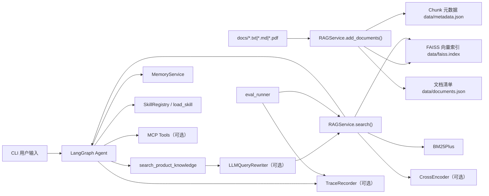

# RAG Server 项目技术文档

> 基于 2026-05-06 的仓库代码快照整理，**以当前代码实现为准**，不是对 `README.md` 的转述。

## 1. 项目概述

`RAG Server` 是一个面向中文知识库场景的本地 RAG 组件库，当前主要服务于电商客服类问答。项目并不是 HTTP 服务，而是一个可复用的 Python 包，加上一套 CLI Agent、长期记忆、Skills、MCP 工具接入、Trace 和检索评测能力。

当前项目的核心定位有三层：

1. **知识检索层**：把商品文档入库，提供向量检索、BM25 检索、混合召回和 CrossEncoder 精排。
2. **Agent 编排层**：用 LangGraph 把检索、记忆、Skills、MCP 工具拼成一个可运行的客服 Agent。
3. **工程支撑层**：提供长期记忆、可观测性、评测和可扩展的工具接入机制。

## 2. 技术栈

| 类别 | 组件 |
|---|---|
| 语言 / 运行时 | Python 3.12+ |
| 包管理 | `uv` |
| 向量检索 | `faiss-cpu` |
| Embedding | `DashScopeEmbeddings` (`text-embedding-v4`) |
| 关键词检索 | `rank-bm25` (`BM25Plus`) + `jieba` |
| 精排 | `sentence-transformers` `CrossEncoder` (`BAAI/bge-reranker-v2-m3`) |
| LLM | `ChatTongyi`，默认模型 `qwen3-max-2026-01-23` |
| 文本切分 | `langchain-text-splitters` |
| Agent 编排 | `langgraph` |
| Tool 抽象 | `langchain_core.tools` |
| MCP 客户端 | `langchain-mcp-adapters` |
| PDF 解析 | `pypdf` |
| 存储 | 本地 JSON / JSONL / SQLite / FAISS |
| 测试 | `unittest` |

## 3. 目录结构

```text
RAG Server/
├── main.py                       # CLI 启动入口
├── pyproject.toml                # 项目依赖
├── README.md                     # 使用说明
├── mcp_servers.json              # MCP 配置（当前仓库中为空）
├── rag_server/
│   ├── __init__.py
│   ├── rag_service.py            # RAG 检索与文档生命周期
│   ├── cli.py                    # LangGraph CLI Agent
│   ├── memory_service.py         # 长期记忆与记忆抽取
│   ├── query_rewrite.py          # Query Rewrite / Multi-query 检索
│   ├── skill_service.py          # Anthropic-style Skills
│   ├── mcp_service.py            # MCP 配置解析与工具加载
│   ├── trace_service.py          # JSONL Trace
│   ├── eval_service.py           # 检索评测逻辑
│   └── eval_runner.py            # 检索评测 CLI
├── docs/                         # 示例知识库文档 + 本技术文档
├── data/                         # RAG 索引与元数据
├── evals/                        # 检索评测数据集
├── examples/                     # 入库示例
├── tests/                        # 单元测试
└── .claude/skills/               # 项目级 Skills
```

## 4. 总体架构



## 5. 核心模块说明

### 5.1 `rag_server/rag_service.py`

`RAGService` 是项目的检索核心，负责文档入库、索引持久化和检索链路。

#### 主要能力

- 支持文档格式：`.txt`、`.md`、`.pdf`
- 文档切分：`RecursiveCharacterTextSplitter`
- 向量检索：FAISS `IndexFlatIP`
- 中文关键词检索：`jieba.lcut_for_search` + `BM25Plus`
- 混合召回：向量分数和 BM25 分数加权融合
- 精排：CrossEncoder 重排序
- 文档生命周期：`add / upsert / update / delete / sync / list`

#### 持久化文件

- `data/faiss.index`：向量索引
- `data/metadata.json`：chunk 级别元数据
- `data/documents.json`：文档级 manifest

#### 文档入库机制

入库的核心方法是 `add_documents()`，本质上调用 `upsert_documents()`。实现特点：

1. 读取文件内容并计算 `source_hash`
2. 基于 `chunk_size` 和 `chunk_overlap` 切分文本
3. 生成 `doc_id` 和 `chunk_id`
4. 如果文档内容和切分参数均未变化，则跳过
5. 如果变化，则删除旧 chunk，重新生成新 chunk
6. 重建 FAISS 索引和 BM25 语料
7. 持久化索引与元数据

#### 标识规则

- `doc_id`：`sha256(绝对路径)` 的前 24 位
- `chunk_id`：`{doc_id}:{chunk_index}:{content_hash[:12]}`

#### 检索链路

`search()` 的默认流程如下：

1. `search_by_hybrid()` 做混合召回
2. 候选数量至少为 `top_k`，默认候选数 `default_candidate_top_k=20`
3. 如果启用精排，则调用 `rerank()`
4. 返回最终 `top_k` 结果

#### 分数逻辑

- 向量索引使用 **L2 归一化后的内积**，效果接近余弦相似度
- 向量分数被映射到 `[0, 1]`
- BM25 分数按当前查询结果的最大值归一化到 `[0, 1]`
- 默认融合权重：`vector=0.7`，`bm25=0.3`

#### 设计特点

- BM25 不做独立持久化，启动时根据 `records` 重建
- CrossEncoder 懒加载，避免只做入库时也触发大模型下载
- `documents.json` 缺失时，可根据 `metadata.json` 自动补齐内存中的文档清单

#### 当前边界

- PDF 仅依赖 `pypdf.PdfReader.extract_text()`，不包含 OCR
- 本地文件写入没有做多进程并发保护，更适合作为单机库或单实例服务组件

### 5.2 `rag_server/cli.py`

`cli.py` 实现了一个面向电商客服的 LangGraph Agent，并提供命令行交互入口。

#### Agent 状态

`AgentState` 里维护了这些核心字段：

- `messages`
- `user_id`
- `latest_user_message`
- `memory_context`
- `skill_context`
- `active_skill_names`

#### LangGraph 流程

```text
START
  -> load_memory
  -> load_skills
  -> agent
      -> tools? yes -> tools -> agent
      -> tools? no  -> save_memory -> END
```

#### 内置工具

1. `search_product_knowledge`
2. `load_skill`
3. `read_skill_file`
4. MCP 注入的外部工具（可选）

#### 检索工具行为

`search_product_knowledge` 根据 `query_rewrite_mode` 有三种主路径：

- `off`：直接 `rag.search(question)`
- `rewrite_only`：先改写为一个检索问题，再检索
- `multi_query/on`：生成多个检索 query，分别召回后合并候选，再以原问题精排

#### Agent 系统约束

系统提示词明确规定：

- 商品事实优先来自知识库
- 长期记忆只能作为用户偏好或历史信息，不能当商品事实
- Skills 可控制工作流程，但不能覆盖“商品事实必须来自知识库”的原则
- MCP 工具只用于外部系统，不与商品知识库混淆

#### CLI 命令

除普通对话外，还支持：

- `/memory`
- `/remember`
- `/remember-procedure`
- `/remember-episode`
- `/forget`
- `/clear-memory`

其中 `/remember` 在当前代码中写入的 `memory_type` 实际是 `instruction`。

#### 运行期特点

- 会话消息保存在进程内存中的 `messages` 列表里，程序退出后丢失
- 长期记忆会落盘到 `memory/`
- 当前 CLI 没有开放 `--data-dir`、`--memory-dir`、`--agent-model` 之类参数，`data` 和 `memory` 路径在 `run_cli_async()` 内写死

### 5.3 `rag_server/memory_service.py`

`MemoryService` 提供按用户隔离的长期记忆能力。

#### 存储模型

- 结构化记录：SQLite `memory/memory.sqlite`
- 语义索引：每个用户一个独立的 FAISS 索引，存放在 `memory/indexes/`

这种设计避免了不同用户记忆混检，也让删除和清空操作更直接。

#### 记忆类型

支持的 `memory_type`：

- `profile`
- `preference`
- `constraint`
- `instruction`
- `episode`
- `procedure`

系统又把它们映射成三个语义层：

- `profile`：画像、偏好、约束、长期指令
- `episode`：有复用价值的历史事件
- `procedure`：用户明确要求长期遵循的流程

#### 数据表

表名：`memories`

核心字段：

- `id`
- `user_id`
- `content`
- `memory_type`
- `importance`
- `source`
- `metadata_json`
- `created_at`
- `updated_at`
- `expires_at`
- `deleted_at`

删除采用 **软删除**，即写入 `deleted_at`。

#### 检索机制

1. 仅在当前 `user_id` 下取索引
2. 只检索未删除且未过期的记忆
3. 使用向量相似度召回
4. 支持按 layer 或 memory type 过滤

#### 记忆抽取器

`LLMMemoryExtractor` 在对话结束后抽取可长期保存的信息，特点如下：

- 默认模型：`qwen3-max-2026-01-23`
- 输出强制为 JSON
- 明确禁止保存敏感信息
- 最多保留 5 条抽取结果

### 5.4 `rag_server/query_rewrite.py`

这个模块负责把用户原问题改写成更适合知识库检索的 query。

#### `LLMQueryRewriter`

输出结构：

- `rewritten_query`
- `search_queries`
- `notes`
- `raw_response`

#### `search_with_query_rewrites()`

多 query 检索流程：

1. 对每个改写 query 执行 `rag.search_by_hybrid()`
2. 用 `(source, chunk_index)` 对候选去重
3. 对重复命中的 chunk，保留最高 `hybrid_score`
4. 记录该 chunk 命中了哪些 query
5. 如果启用精排，则用**原始问题**做 rerank

这保证了 query 扩展提升召回时，不会破坏最终排序的用户语义。

### 5.5 `rag_server/skill_service.py`

该模块实现了 Anthropic-style Skills 的发现、加载和受控访问。

#### Skill 约定

- 路径：`.claude/skills/<skill-name>/SKILL.md`
- `SKILL.md` 必须以 YAML frontmatter 开头
- `frontmatter.name` 必须和目录名一致
- 名称只能是小写字母、数字、短横线

#### 关键能力

- `list_skills()`：扫描技能
- `discovery_prompt()`：只暴露元数据，供模型先发现技能
- `load_skill(name)`：按需读取完整 `SKILL.md`
- `read_supporting_file(name, relative_path)`：读取支撑文件

#### 安全机制

- 支撑文件读取限制在 skill 目录内
- 拒绝路径穿越
- 可限制 skill 允许调用的工具集合

#### 当前项目内置 Skills

- `sizing-advice`
- `care-guidance`

都要求优先调用 `search_product_knowledge`，属于“知识库优先、技能约束回答方式”的设计。

### 5.6 `rag_server/mcp_service.py`

该模块负责解析 `mcp_servers.json`，再通过 `MultiServerMCPClient` 加载工具。

#### 配置格式

支持两种 JSON 形态：

1. `{"servers": {"name": {...}}}`
2. `{"name": {...}}`

#### 支持的 transport

- `stdio`
- `sse`
- `websocket`
- `http`
- `streamable_http`

#### 关键特性

- 支持 `enabled: false` 禁用单个 server
- 支持 `${ENV_VAR}` 和 `${ENV_VAR:-default}` 环境变量展开
- `http` / `streamable_http` 的 timeout 会转成 `timedelta`
- 默认开启 `tool_name_prefix`，避免工具名冲突

#### 当前仓库状态

根目录 `mcp_servers.json` 当前是空文件，意味着示例配置还没有落地。

### 5.7 `rag_server/trace_service.py`

`TraceRecorder` 提供本地 JSONL Trace 能力。

#### 记录格式

每条记录包含：

- `run_id`
- `event_id`
- `timestamp`
- `type`
- `name`
- `level`
- `parent_id`
- `span_id`
- `elapsed_ms`
- `tags`
- `payload`

#### 使用方式

- `event()`：直接记录事件
- `span()`：记录开始 / 结束 / 异常
- `load_trace()`：回读 JSONL

目前 RAG 检索、Agent 调用、Skill、Memory、Eval 都能接入 Trace。

### 5.8 `rag_server/eval_service.py` 与 `rag_server/eval_runner.py`

这两部分组成检索评测框架。

#### 数据集格式

支持 `.json` 和 `.jsonl`，单条 case 可包含：

- `id`
- `query`
- `expected_sources`
- `expected_doc_ids`
- `expected_substrings`

#### 评测指标

- `hit_rate`
- `mrr`
- `source_hit_rate`
- `substring_hit_rate`

#### 评测流程

1. 加载数据集
2. 对每个 case 执行 `rag.search()`
3. 判断 source / substring / doc_id 是否命中
4. 输出 case 级明细与 summary
5. 可选写入 JSON 报告与 Trace

## 6. 关键流程详解

### 6.1 文档入库流程

```text
文件路径
  -> 读取文本
  -> 按 chunk_size/chunk_overlap 切块
  -> embedding
  -> 写入 records
  -> 重建 FAISS
  -> 重建 BM25
  -> 持久化 metadata.json / documents.json / faiss.index
```

### 6.2 查询检索流程

```text
用户问题
  -> 可选 query rewrite
  -> 向量召回
  -> 可选 BM25 召回
  -> 加权融合
  -> 取候选 candidate_top_k
  -> 可选 CrossEncoder 精排
  -> 返回 top_k
```

### 6.3 Agent 对话流程

```text
用户输入
  -> 检索相关长期记忆
  -> 加载可用 Skills 元数据
  -> LLM 决定是否调用工具
  -> 调用检索 / skill / MCP 工具
  -> LLM 生成最终回复
  -> 抽取并保存长期记忆
```

## 7. 对外能力与公共接口

### 7.1 检索接口

常用入口：

- `RAGService.add_documents(file_paths)`
- `RAGService.update_document(file_path)`
- `RAGService.delete_document(document_ref)`
- `RAGService.sync_documents(file_paths, remove_missing=True|False)`
- `RAGService.search(query, top_k=3, ...)`
- `RAGService.search_by_vector(...)`
- `RAGService.search_by_bm25(...)`
- `RAGService.search_by_hybrid(...)`
- `RAGService.rerank(query, candidates, top_k=...)`

### 7.2 记忆接口

- `MemoryService.add_memory(...)`
- `MemoryService.add_memories(...)`
- `MemoryService.list_memories(user_id)`
- `MemoryService.search_memory(user_id, query, ...)`
- `MemoryService.search_memory_layers(user_id, query, ...)`
- `MemoryService.forget_memory(memory_id, user_id=...)`
- `MemoryService.clear_user_memory(user_id)`

### 7.3 Skill / MCP / Eval 接口

- `SkillRegistry.from_project_root(...)`
- `load_mcp_config(path)`
- `load_mcp_tools_from_config(path)`
- `evaluate_retrieval_dataset(rag, dataset_path, ...)`

## 8. 当前仓库内的数据与样例

### 示例知识库

`docs/` 下当前有三类示例文档：

- `尺码推荐`
- `颜色选择`
- `洗涤养护`

这套样例与电商客服 Agent 的默认提示词、Skills 和评测数据是互相对应的。

### 当前 `data/` 状态

仓库里已经存在：

- `data/faiss.index`
- `data/metadata.json`

当前未看到 `data/documents.json`。结合代码逻辑，这不影响加载，`RAGService` 会在内存里根据 `metadata.json` 补齐 manifest，并在下一次持久化时重新生成 `documents.json`。

### 当前 `memory/` 与 `traces/` 状态

`.gitignore` 已把 `memory/`、`traces/` 视为运行期数据。当前工作区里有本地运行产物，但它们不属于项目核心源码的一部分。

## 9. 配置与运行方式

### 环境变量

必须提供：

```bash
export DASHSCOPE_API_KEY="..."
```

项目中的 Embedding、Agent、Query Rewrite、Memory Extractor 都依赖 DashScope。

### 常用命令

安装依赖：

```bash
uv sync
```

示例入库：

```bash
uv run python examples/ingest_documents.py
```

启动 CLI：

```bash
uv run python main.py
```

运行评测：

```bash
uv run python -m rag_server.eval_runner \
  --dataset evals/retrieval_eval.jsonl \
  --data-dir data \
  --top-k 3 \
  --cross-encoder off
```

### 主要 CLI 参数

`main.py` 当前支持：

- `--query-rewrite`
- `--bm25`
- `--cross-encoder`
- `--rewrite-model`
- `--user-id`
- `--memory`
- `--memory-model`
- `--skills`
- `--skills-dir`
- `--mcp`
- `--mcp-config`
- `--trace`
- `--trace-dir`

## 10. 测试情况

项目当前使用 `unittest`，测试覆盖了以下核心场景：

- RAG 文档 upsert / delete / sync
- Memory 用户隔离与分层检索
- Skill frontmatter 解析与路径安全
- MCP 配置解析与工具加载
- Trace 记录
- Eval 命中率统计
- Agent 对话完成后的记忆保存

本次检查时执行命令：

```bash
uv run python -m unittest discover -s tests -v
```

结果：**16 个测试全部通过**。

## 11. 设计优点

### 优点 1：模块边界清晰

检索、记忆、Agent、Skills、MCP、Trace、Eval 拆分明确，后续做 HTTP 包装比较顺手。

### 优点 2：RAG 生命周期完整

不是只有一个 `search()`，而是完整覆盖了文档入库、增量更新、删除、同步、评测和可观测性。

### 优点 3：对中文电商场景做了定制

- 中文切分与 BM25
- 电商客服提示词
- 尺码 / 洗护 Skills
- 长期记忆抽取策略

### 优点 4：扩展点比较自然

- 可替换 embeddings / reranker / LLM
- 可追加 Skills 目录
- 可接 MCP 工具
- 可用 FastAPI / Flask 再包一层服务

## 12. 当前边界与后续建议

### 当前边界

1. 这不是 HTTP 服务，只是库和 CLI 原型。
2. 所有模型能力都依赖 DashScope，没有离线模式。
3. CrossEncoder 首次启用时会下载较大的模型文件。
4. 本地持久化更适合单机单实例，不适合直接并发写入。
5. CLI 当前没有暴露 `data_dir`、`memory_dir`、`agent_model` 等配置项。

### 后续建议

1. **补一层 FastAPI**：把 `RAGService`、`MemoryService`、`build_agent()` 封装成 API。
2. **补配置管理**：把数据目录、模型名、权重等集中到配置文件或环境变量。
3. **补并发与锁**：如果要多进程部署，需要为索引文件和 manifest 增加写入保护。
4. **补更完整评测**：加入召回率、延迟、不同 query rewrite 策略对比。
5. **补生产化日志**：Trace 已有基础，可再输出结构化日志与指标。

## 13. 推荐阅读顺序

如果后续要继续维护这个项目，建议按下面顺序读代码：

1. `README.md`
2. `rag_server/rag_service.py`
3. `rag_server/cli.py`
4. `rag_server/memory_service.py`
5. `rag_server/query_rewrite.py`
6. `rag_server/skill_service.py`
7. `rag_server/mcp_service.py`
8. `rag_server/trace_service.py`
9. `rag_server/eval_service.py`
10. `tests/`

---

如果只用一句话概括这个项目：**它已经不是一个“只会搜文档”的 RAG demo，而是一套围绕中文电商客服场景搭出来的本地 Agent 组件底座。**
