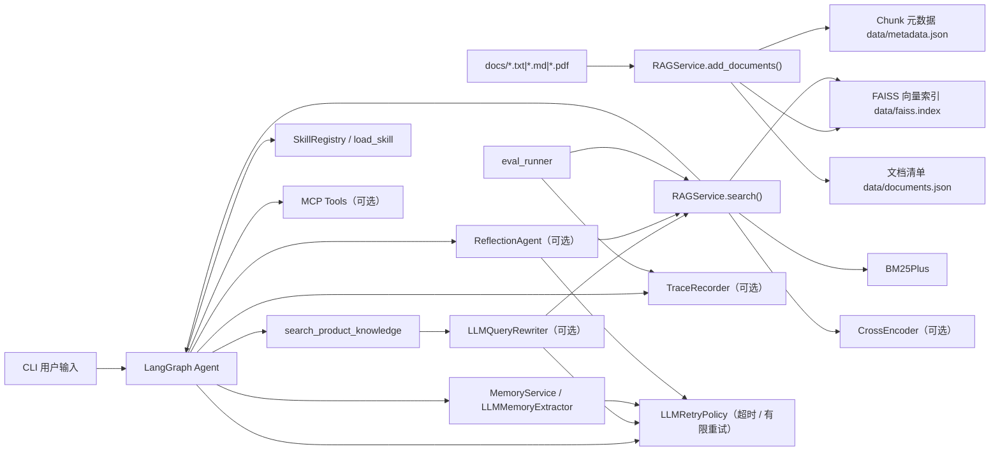

# RAG Server 项目技术文档

> 这份文档聚焦架构、模块边界和实现约束。安装、快速开始、常见命令以 [README.md](./README.md) 为准。

## 1. 项目定位

`RAG Server` 是一个面向中文知识库场景的本地 RAG / Agent 组件库，当前主要服务于电商客服类问答。它不是 HTTP 服务，而是一个可复用的 Python 包，加上一套 CLI Agent、长期记忆、Skills、MCP 工具接入、Trace 和检索评测能力。

从职责上看，当前仓库可以分成三层：

1. **知识检索层**：负责文档入库、向量检索、BM25、混合召回和 CrossEncoder 精排。
2. **Agent 编排层**：负责把检索、记忆、Skills、MCP 工具串成一个可运行的 LangGraph Agent。
3. **工程支撑层**：负责长期记忆、可观测性、评测和扩展机制。

## 2. 技术栈

| 类别 | 组件 |
|---|---|
| 语言 / 运行时 | Python 3.12+ |
| 包管理 | `uv` |
| 向量检索 | `faiss-cpu` |
| Embedding | `DashScopeEmbeddings` (`text-embedding-v4`) |
| 关键词检索 | `rank-bm25` (`BM25Plus`) + `jieba` |
| 精排 | `sentence-transformers` `CrossEncoder` (`BAAI/bge-reranker-v2-m3`) |
| LLM | `ChatTongyi`，默认模型 `qwen3-max-2026-01-23` |
| LLM 稳定性 | `LLMRetryPolicy`：超时、有限重试、指数退避 |
| 文本切分 | `langchain-text-splitters` |
| Agent 编排 | `langgraph` |
| Tool 抽象 | `langchain_core.tools` |
| MCP 客户端 | `langchain-mcp-adapters` |
| PDF 解析 | `pypdf` |
| 存储 | 本地 JSON / JSONL / SQLite / FAISS |
| 测试 | `unittest` |

## 3. 目录结构

```text
RAG Server/
├── main.py                       # CLI 启动入口
├── README.md                     # 上手与使用说明
├── 项目技术文档.md               # 架构与实现说明
├── pyproject.toml                # 项目元信息与依赖
├── mcp_servers.json              # 默认空 MCP 配置
├── mcp_servers.example.json      # MCP 示例配置
├── rag_server/
│   ├── __init__.py
│   ├── rag_service.py            # RAG 检索与文档生命周期
│   ├── cli.py                    # LangGraph CLI Agent
│   ├── config.py                 # 运行配置加载与校验
│   ├── memory_service.py         # 长期记忆与记忆抽取
│   ├── query_rewrite.py          # Query rewrite / multi-query 检索
│   ├── reflection_service.py     # 回答后 Reflection、补检索与修正
│   ├── llm_retry.py              # LLM 超时、有限重试与退避策略
│   ├── skill_service.py          # Anthropic-style Skills
│   ├── mcp_service.py            # MCP 配置解析与工具加载
│   ├── trace_service.py          # JSONL Trace
│   ├── eval_service.py           # 检索评测逻辑
│   └── eval_runner.py            # 检索评测 CLI
├── docs/                         # 示例知识库文档
├── data/                         # RAG 索引与元数据
├── evals/                        # 检索评测数据集
├── examples/                     # 入库示例
├── tests/                        # 单元测试
└── .claude/skills/               # 项目级 Skills
```

## 4. 总体架构



## 5. 运行时资产与边界

### 5.1 持久化资产

- `data/faiss.index`：知识库向量索引
- `data/metadata.json`：chunk 级元数据
- `data/documents.json`：文档级 manifest
- `memory/memory.sqlite`：长期记忆结构化数据
- `memory/indexes/`：按用户隔离的记忆向量索引
- `traces/*.jsonl`：运行 trace

### 5.2 关键边界

- 当前没有 HTTP 服务层，主要入口是 Python API 和 CLI
- 所有默认模型能力依赖 DashScope，没有离线 embedding / LLM 模式
- LLM 调用有有限重试和单次超时保护，但重试耗尽后仍会返回错误或走降级路径
- PDF 只依赖 `pypdf` 文本抽取，不支持 OCR
- 本地文件持久化没有做多进程并发写保护，更适合作为单机组件或单实例服务底座
- CLI 支持通过配置文件、环境变量和命令行参数覆盖路径、模型与功能开关

## 6. 核心模块说明

### 6.1 `rag_server/rag_service.py`

`RAGService` 是检索核心，负责文档入库、索引持久化和检索链路。

#### 主要能力

- 支持 `.txt`、`.md`、`.pdf`
- 使用 `RecursiveCharacterTextSplitter` 做 Parent-Child Chunk 两级切块
- 使用 FAISS `IndexFlatIP` 做多向量检索
- 使用 `jieba.lcut_for_search` + `BM25Plus` 做中文关键词检索
- 支持向量分数与 BM25 分数加权融合
- 支持可选 CrossEncoder 精排
- 提供 `add / upsert / update / delete / sync / list` 文档生命周期接口

#### 文档入库机制

1. 读取文件内容并计算 `source_hash`
2. 先按 `parent_chunk_size` / `parent_chunk_overlap` 切父块
3. 再按 `chunk_size` / `chunk_overlap` 将每个父块切成子块
4. 生成 `doc_id`、父块 `chunk_id` 与子块 `child_chunk_id`
5. 如果文档内容与切分参数未变化，则跳过
6. 如果变化，则删除旧 chunk 并重新生成
7. 为每个子块生成 `summary`、`keyword`、`semantic` 三类 embedding 文本，并写入多向量 FAISS 索引
8. 用子块重建 BM25 语料，检索结果先聚合回子块，再按父块去重并返回父块内容
9. 持久化索引和元数据

#### 标识规则

- `doc_id`：`sha256(绝对路径)` 的前 24 位
- `chunk_id`：父块 ID，作为最终返回内容的 chunk 标识
- `child_chunk_id`：子块 ID，作为 BM25 实际索引单元和多向量聚合目标标识
- `embedding_strategy`：当前为 `summary_keyword_semantic_v1`

#### 检索链路

`search()` 的默认流程：

1. `search_by_hybrid()` 做混合召回，其中向量侧会先对 `summary`、`keyword`、`semantic` 三类向量并行召回并聚合为 `vector_score`
2. 候选数量至少为 `top_k`，默认 `default_candidate_top_k=20`
3. 如果启用精排，则调用 `rerank()`
4. 返回最终 `top_k` 结果

#### 分数逻辑

- 向量索引使用 L2 归一化后的内积，效果接近余弦相似度
- 每类向量分数会映射到 `[0, 1]`，再按默认权重 `semantic=0.5`、`summary=0.25`、`keyword=0.25` 对实际命中的向量类型做加权平均
- BM25 分数按当前查询结果的最大值归一化到 `[0, 1]`
- 默认融合权重：`vector=0.7`，`bm25=0.3`

#### 设计特点

- BM25 不独立持久化，启动时根据 `records` 重建
- CrossEncoder 懒加载，避免入库场景触发额外模型下载
- `documents.json` 缺失时，可根据 `metadata.json` 自动补齐内存中的文档清单

### 6.2 `rag_server/cli.py`

`cli.py` 实现了面向电商客服的 LangGraph Agent 和命令行交互入口。

#### Agent 状态

`AgentState` 里维护这些核心字段：

- `messages`
- `user_id`
- `latest_user_message`
- `memory_context`
- `skill_context`
- `active_skill_names`
- `tool_round_count`
- `last_tool_call_signature`
- `repeated_tool_call_count`

#### LangGraph 流程

```text
START
  -> load_memory
  -> load_skills
  -> agent
      -> tool calls? yes, under limits -> tools -> agent
      -> tool calls? yes, over limits  -> loop_guard -> save_memory -> END
      -> tool calls? no               -> agent 内 Reflection（可选） -> save_memory -> END
```

`reflection` 在最终回复前执行：

1. 读取用户问题、初次回答和最近工具/检索证据
2. 调用 Reflection 模型判断是否存在未被证据支持的事实或需要更多证据
3. 如果疑似 hallucination，则用建议 query 对 RAG 做补检索
4. 基于原证据和补充证据生成修正回答；证据仍不足时明确无法确认

#### 内置工具

1. `search_product_knowledge`
2. `load_skill`
3. `read_skill_file`
4. MCP 注入的外部工具

#### 检索工具行为

`search_product_knowledge` 根据 `query_rewrite_mode` 有三条主路径：

- `off`：直接 `rag.search(question)`
- `rewrite_only`：先改写为一个检索问题，再检索
- `multi_query/on`：生成多个检索 query，分别召回后合并候选，再以原问题精排

如果 query rewrite 的 LLM 调用重试耗尽，检索工具会降级为直接使用原始问题检索，并在开启 trace 时记录 `query_rewrite.fallback_to_original`。

#### 运行期特点

- 会话消息保存在进程内存中的 `messages` 列表里，程序退出后丢失
- 长期记忆默认落盘到 `memory/`，可通过 `--memory-dir` 或配置覆盖
- RAG 数据目录默认是 `data/`，可通过 `--data-dir` 或配置覆盖
- `--cross-encoder` 默认关闭，只有显式开启时才会触发精排模型加载
- Agent、query rewrite、reflection、memory extractor 共用 `LLMRetryPolicy`
- 默认 LLM 策略：最多 `3` 次尝试，单次超时 `30s`，首次退避 `1s`，之后指数退避
- CLI 可通过 `--llm-retry-attempts`、`--llm-timeout`、`--llm-retry-backoff` 调整 LLM 策略
- 单轮用户输入默认最多 `6` 轮工具调用；相同工具调用默认最多连续重复 `2` 次
- 工具循环保护可通过 `--max-tool-rounds` 与 `--max-repeated-tool-calls` 调整
- CLI 默认开启实时事件展示：RAG 检索、memory 读取、Skill 加载 / 文件读取、MCP 工具调用都会同步打印到终端；可用 `--live-events off` 关闭

### 6.3 `rag_server/config.py`

`config.py` 负责把内置默认值、配置文件、环境变量和 CLI 参数合并成统一的 `AppConfig`。

#### 配置对象

- `PathSettings`：`data_dir`、`memory_dir`、`trace_dir`、`mcp_config_path`
- `AgentSettings`：主模型、`user_id`、工具循环保护、Reflection 开关
- `RetrievalSettings`：query rewrite、BM25、CrossEncoder 开关
- `LLMSettings`：rewrite / memory 模型、重试次数、单次超时、退避时间
- `MemorySettings`：长期记忆开关与每层召回数量
- `SkillsSettings`：Skills 开关与额外 Skills 目录
- `MCPSettings`：MCP 开关
- `TraceSettings`：JSONL trace 与 CLI 实时事件开关

#### 加载顺序

`load_app_config()` 按下面顺序合并，后者覆盖前者：

```text
AppConfig 默认值
  -> --config 或 RAG_SERVER_CONFIG 指向的 .toml / .json 文件
  -> RAG_SERVER_* 环境变量
  -> CLI overrides
```

配置加载会拒绝未知 section 和未知 key，避免拼写错误静默失效；同时兼容一批旧字段别名，例如 `retrieval.query_rewrite_mode`、`retrieval.bm25_enabled`、`agent.reflection` 和 `trace.live_events`。

#### 运行时映射

`AppConfig.to_runtime_kwargs()` 会把配置映射成 `run_cli()` 需要的参数。`llm.rewrite_model` 和 `llm.memory_model` 为空时会回落到 `agent.model`，保证只配置一个主模型也能完整启动。

### 6.4 `rag_server/memory_service.py`

`MemoryService` 提供按用户隔离的长期记忆。

#### 存储模型

- 结构化记录：SQLite `memory/memory.sqlite`
- 语义索引：每个用户一个独立的 FAISS 索引，保存在 `memory/indexes/`

这种设计避免了不同用户记忆混检，也让删除和清空操作更直接。

#### 记忆类型

- `profile`
- `preference`
- `constraint`
- `instruction`
- `episode`
- `procedure`

系统会把它们映射成三个语义层：

- `profile`：画像、偏好、约束、长期指令
- `episode`：可复用的历史事件摘要
- `procedure`：需要长期遵循的流程

#### 数据表

表名：`memories`

核心字段：

- `id`
- `user_id`
- `content`
- `memory_type`
- `importance`
- `source`
- `metadata_json`
- `created_at`
- `updated_at`
- `expires_at`
- `deleted_at`

删除采用软删除，即写入 `deleted_at`。

#### 检索机制

1. 仅在当前 `user_id` 下使用对应索引
2. 只检索未删除且未过期的记忆
3. 使用向量相似度召回
4. 支持按 layer 或 memory type 过滤

#### 记忆抽取器

`LLMMemoryExtractor` 在对话结束后抽取可长期保存的信息：

- 默认模型：`qwen3-max-2026-01-23`
- 输出强制为 JSON
- 明确禁止保存敏感信息
- 最多保留 5 条抽取结果
- 使用 `LLMRetryPolicy` 做有限重试；失败不会中断主回复，只会跳过本轮记忆保存并写 trace

### 6.5 `rag_server/query_rewrite.py`

这个模块负责把用户原问题改写成更适合知识库检索的 query。

#### `LLMQueryRewriter`

输出结构：

- `rewritten_query`
- `search_queries`
- `notes`
- `raw_response`

改写模型调用同样使用 `LLMRetryPolicy`。如果开启 trace，每次可重试失败会记录为 `query_rewrite.model_retry`；最终失败由检索工具降级为原始问题检索。

#### `search_with_query_rewrites()`

流程如下：

1. 对每个改写 query 执行 `rag.search_by_hybrid()`
2. 用 `(source, chunk_index)` 对候选去重
3. 对重复命中的 chunk 保留最高 `hybrid_score`
4. 记录该 chunk 命中了哪些 query
5. 如果启用精排，则用原始问题做 rerank

### 6.6 `rag_server/reflection_service.py`

`ReflectionAgent` 是回答后的事实安全网，用于审查并修正 Agent 已生成的客服回复。

#### 核心流程

1. `reflect()` 接收用户问题、初次回答、最近工具证据、长期记忆上下文和 Skill 上下文
2. Reflection 模型只输出 JSON，判断 `has_hallucination`、`needs_more_evidence`、`search_query` 和 `correction_guidance`
3. 如果不需要修正，直接返回初次回答
4. 如果需要更多证据，使用建议 query 或原问题调用 `rag.search()` 做补检索
5. `revise()` 基于原证据、补充证据和修正建议重写最终客服回复

#### 失败策略

- Reflection 的模型调用使用同一套 `LLMRetryPolicy`
- 审查、补检索或修正失败时不会中断主回复，而是保留初次回答并写入 warning trace
- 证据仍不足时，修正提示要求模型明确说明当前无法确认，而不是补造商品事实

### 6.7 `rag_server/skill_service.py`

该模块实现了 Anthropic-style Skills 的发现、加载和受控访问。

#### Skill 约定

- 路径：`.claude/skills/<skill-name>/SKILL.md`
- `SKILL.md` 必须以 YAML frontmatter 开头
- `frontmatter.name` 必须和目录名一致
- 名称只能包含小写字母、数字和短横线

#### 关键能力

- `list_skills()`：扫描技能
- `discovery_prompt()`：只暴露元数据，供模型先发现技能
- `load_skill(name)`：按需读取完整 `SKILL.md`
- `read_supporting_file(name, relative_path)`：读取支撑文件

#### 安全机制

- 支撑文件读取限制在 skill 目录内
- 拒绝路径穿越
- 可限制 skill 允许调用的工具集合

### 6.8 `rag_server/mcp_service.py`

该模块负责解析 `mcp_servers.json`，再通过 `MultiServerMCPClient` 加载工具。

#### 配置格式

支持两种 JSON 形态：

1. `{"servers": {"name": {...}}}`
2. `{"name": {"transport": "stdio", ...}}`

#### 支持的 transport

- `stdio`
- `sse`
- `websocket`
- `http`
- `streamable_http`

#### 关键特性

- 支持 `enabled: false` 禁用单个 server
- 支持 `${ENV_VAR}` 和 `${ENV_VAR:-default}` 环境变量展开
- `http` / `streamable_http` 的超时会转成 `timedelta`
- 默认开启 `tool_name_prefix`，避免工具名冲突

#### 仓库内约定

- `mcp_servers.json` 是默认空配置，保证仓库开箱即用
- `mcp_servers.example.json` 提供可修改的示例

### 6.9 `rag_server/trace_service.py`

`TraceRecorder` 提供本地 JSONL Trace 能力。

#### 记录字段

- `run_id`
- `event_id`
- `timestamp`
- `type`
- `name`
- `level`
- `parent_id`
- `span_id`
- `elapsed_ms`
- `tags`
- `payload`

#### 使用方式

- `event()`：直接记录事件
- `metric()`：记录轻量指标事件
- `span()`：记录开始 / 结束 / 异常
- `event_sinks`：把事件同步推送给额外消费者，例如 CLI 实时打印器；即使 JSONL trace 关闭也可以工作
- `load_trace()`：回读 JSONL
- `summarize_trace()`：汇总事件数、level、类型、常见 name 和累计耗时

目前 RAG、Agent、Query rewrite、Reflection、Skill、Memory、MCP 和 Eval 都可以接入 Trace。CLI 启动配置、单轮对话耗时、模型 usage 元数据、LLM 重试失败、query rewrite 降级、Agent 工具循环保护也会记录为事件。Trace 写入前会按键名脱敏常见敏感字段，例如 `api_key`、`authorization`、`password`、`token`、`secret`。

CLI 实时事件复用同一条 TraceRecorder 事件总线，默认只打印 RAG、memory、Skill 和 MCP 相关事件，避免把普通模型调用和内部状态全部刷到终端。

### 6.10 `rag_server/llm_retry.py`

`llm_retry.py` 提供所有 LLM 调用共用的超时与重试策略，避免各模块各自实现不一致的容错逻辑。

#### 核心对象

- `LLMRetryPolicy`：定义最大尝试次数、单次超时、初始退避、退避倍数和最大退避
- `LLMRetryError`：重试耗尽后的统一异常，保留 `operation`、`attempts` 和 `last_error`
- `invoke_with_retry()`：包装同步 LLM 调用
- `ainvoke_with_retry()`：包装异步 LLM 调用

#### 默认策略

- `max_attempts=3`
- `per_attempt_timeout_s=30.0`
- `initial_backoff_s=1.0`
- `backoff_multiplier=2.0`
- `max_backoff_s=8.0`

#### 重试判定

当前只对临时性错误重试：

- `TimeoutError`
- HTTP `408`、`409`、`425`、`429`
- HTTP `5xx`
- 错误文本中包含 timeout、rate limit、throttle、connection、unavailable、overloaded 等临时故障标记

非临时性错误不会重试，避免把配置错误、鉴权错误或参数错误放大成更长的等待。

### 6.11 `rag_server/eval_service.py` 与 `rag_server/eval_runner.py`

这两部分组成检索评测框架。

#### 数据集格式

支持 `.json` 和 `.jsonl`，单条 case 可包含：

- `id`
- `query`
- `expected_sources`
- `expected_doc_ids`
- `expected_substrings`

#### 评测指标

- `hit_rate`
- `mrr`
- `source_hit_rate`
- `substring_hit_rate`

#### 评测流程

1. 加载数据集
2. 对每个 case 执行 `rag.search()`
3. 判断 source / substring / doc_id 是否命中
4. 输出 case 级明细与 summary
5. 可选写入 JSON 报告与 Trace
6. 可通过 `--min-hit-rate` 与 `--min-mrr` 设置回归阈值，低于阈值时退出失败

## 7. 关键流程详解

### 7.1 文档入库

```text
文件路径
  -> 读取文本
  -> 按 parent_chunk_size / parent_chunk_overlap 切父块
  -> 按 chunk_size / chunk_overlap 切子块
  -> 为每个子块生成 summary / keyword / semantic embedding 文本
  -> 写入 records 与 documents manifest
  -> 增量扩展或重建多向量 FAISS
  -> 用子块内容重建 BM25
  -> 持久化 metadata.json / documents.json / faiss.index
```

### 7.2 查询检索

```text
用户问题
  -> 可选 query rewrite（LLM 超时 / 有限重试）
  -> 改写失败则降级为原始问题
  -> summary / keyword / semantic 多向量召回
  -> 聚合为子块 vector_score
  -> 可选 BM25 召回
  -> 加权融合
  -> 按父块去重，返回父块内容
  -> 取候选 candidate_top_k
  -> 可选 CrossEncoder 精排
  -> 返回 top_k
```

### 7.3 Agent 对话

```text
用户输入
  -> 检索相关长期记忆
  -> 加载可用 Skills 元数据
  -> LLM 决定是否调用工具（超时 / 有限重试）
  -> 调用检索 / skill / MCP 工具
  -> 如果超过工具轮次或重复工具调用上限，则进入 loop_guard
  -> LLM 生成最终回复
  -> 可选 Reflection 审查、补检索和修正
  -> 抽取并保存长期记忆（超时 / 有限重试）
```

`loop_guard` 会为未执行的工具调用补一条中止用的 `ToolMessage`，再追加一条最终 `AIMessage`。这样既能结束当前图运行，也能避免带着未闭合 tool call 的历史进入下一轮对话。

## 8. 公开接口与扩展点

### 8.1 检索接口

- `RAGService.add_documents(file_paths)`
- `RAGService.update_document(file_path)`
- `RAGService.delete_document(document_ref)`
- `RAGService.sync_documents(file_paths, remove_missing=True | False)`
- `RAGService.search(query, top_k=3, ...)`
- `RAGService.search_by_vector(...)`
- `RAGService.search_by_bm25(...)`
- `RAGService.search_by_hybrid(...)`
- `RAGService.rerank(query, candidates, top_k=...)`

### 8.2 记忆接口

- `MemoryService.add_memory(...)`
- `MemoryService.add_memories(...)`
- `MemoryService.list_memories(user_id)`
- `MemoryService.search_memory(user_id, query, ...)`
- `MemoryService.search_memory_layers(user_id, query, ...)`
- `MemoryService.forget_memory(memory_id, user_id=...)`
- `MemoryService.clear_user_memory(user_id)`

### 8.3 配置 / Reflection / Skills / MCP / Eval / 稳定性接口

- `load_app_config(config_path, env=..., overrides=...)`
- `AppConfig.to_runtime_kwargs()`
- `ReflectionAgent.review_and_revise(...)`
- `parse_reflection_result(raw_response)`
- `SkillRegistry.from_project_root(...)`
- `load_mcp_config(path)`
- `load_mcp_tools_from_config(path)`
- `evaluate_retrieval_dataset(rag, dataset_path, ...)`
- `LLMRetryPolicy(max_attempts=..., per_attempt_timeout_s=...)`
- `LLMRetryError`

### 8.4 典型扩展方向

- 用 FastAPI / Flask 再包一层服务接口
- 增加新的 Skills 目录或支撑文件
- 接入更多外部 MCP 工具
- 增补评测数据集，做不同检索策略对比
- 替换 embeddings、reranker 或默认模型
- 按部署环境调整 LLM 重试、超时和工具循环保护参数

## 9. 测试与维护说明

当前测试使用 `unittest`，重点覆盖这些场景：

- RAG 文档 upsert / delete / sync、多向量召回、Parent-Child Chunk
- 配置文件 / 环境变量 / CLI 参数优先级
- Memory 用户隔离与分层检索
- Reflection JSON 解析与回答修正
- Skill frontmatter 解析与路径安全
- MCP 配置解析与工具加载
- Trace 记录、脱敏和实时事件
- Eval 命中率统计
- Agent 对话完成后的记忆保存
- LLM 超时、有限重试和重试耗尽
- Agent 工具循环保护

建议使用下面的命令做回归验证：

```bash
uv run python -m unittest discover -s tests -v
```

文档维护上建议保持这个分工：

- `README.md` 负责上手、运行和入口导航
- `项目技术文档.md` 负责架构、实现和边界
- 避免在两份文档里重复记录快照式信息，例如当前运行产物、一次性的测试结果、临时目录状态

## 10. 推荐阅读顺序

1. [README.md](./README.md)
2. `rag_server/rag_service.py`
3. `rag_server/cli.py`
4. `rag_server/config.py`
5. `rag_server/memory_service.py`
6. `rag_server/query_rewrite.py`
7. `rag_server/reflection_service.py`
8. `rag_server/llm_retry.py`
9. `rag_server/skill_service.py`
10. `rag_server/mcp_service.py`
11. `rag_server/trace_service.py`
12. `rag_server/eval_service.py`
13. `tests/`

如果只用一句话概括这个项目：它已经不是一个“只会搜文档”的 RAG demo，而是一套围绕中文电商客服场景搭出来的本地 Agent 组件底座。
